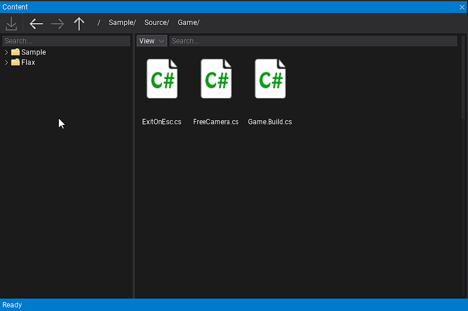
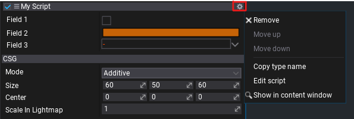
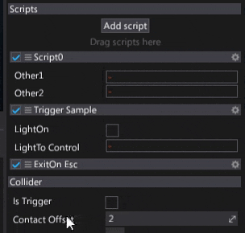

# Create and use a script

Scripts in Flax are primarily written in the **C#** language (source files with extension `.cs`).  
If you want to create a C++ Script you can find out how [here](cpp/index.md).  
To provide better organization in a project workspace script files are located in the `Source/` directory.  
This separates scripts from the assets, which reduces mess and makes it easier to work with project sources.

Flax Editor creates a solution file (`.sln`) and C# projects (`.csproj`) for game scripts and editor plugins.

> [!Note]
> We recommend using Visual Studio for code editing with [Flax Engine Tools for Visual Studio](https://marketplace.visualstudio.com/items?itemName=Flax.FlaxVS) installed.

## Create a script

1. In the *Content* window, Navigate to '&lt;project_name&gt;/Source/&lt;game_module_name&gt;'.
	 
  
2. Double-click to open the script. Wait for Flax to open your IDE, which will then open the new script.

Once opened this is what the script file will look like.
[!code-csharp[Example1](code-examples/events.cs)]

## Use a script

Scripts are **attached to actors**. Every actor can contain an unlimited amount of individual scripts (including multiple instances of the same script type). This means that the script's lifetime is related to that of the actor's and the scene's lifetime. For instance, if you load a scene, the scripts attached to the objects in that scene also will be loaded.

1. Select an actor to add a script to it (note label *Drag scripts here* in **Scripts** group in *Properties* window)
2. Drag and drop the script into the **Drag scripts here** area
3. The script is ready

Sample script with 3 public fields:
    

The Flax Editor shows public script properties and fields using a dedicated group (within `Scripts` group). Each script group header shows a script class type name, **settings button on the right** and **script toggle checkbox on the left**. You can disable or enable the script by using this checkbox.

To **remove**, **edit** or **reorder** a script use the **settings button** which shows a popup with various options.

You can also easily select a reference to a script or reorder it. Simply click and drag the **three-bar icon button** as shown on a gif below:

