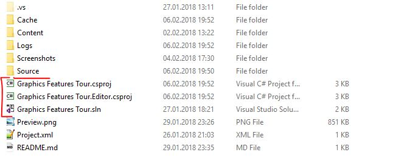
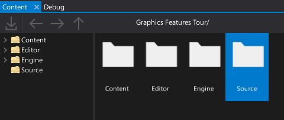
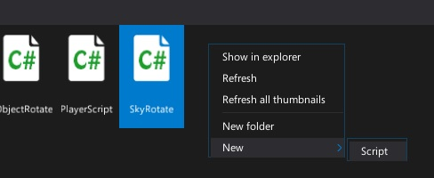
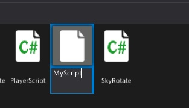
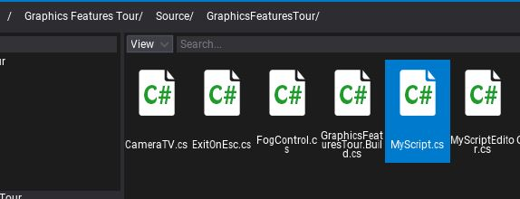
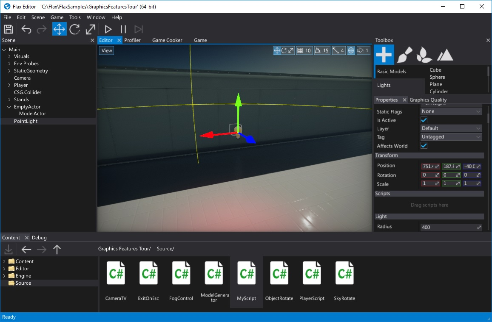
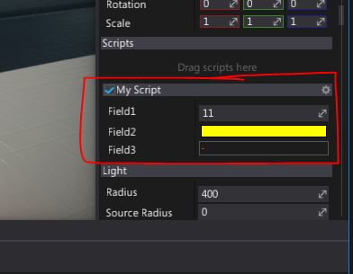
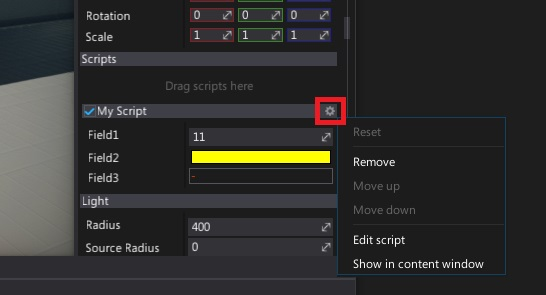

# Create and use a script

Scripts in Flax are written in **C#** language (source files with extension `.cs`).
To provide better organization in a project workspace script files are located in `Source/` directory.
In that way scripts are separated from the assets which reduces mess and makes it easier to work with project sources.

Flax Editor creates a solution file (`.sln`) and C# projects (`.csproj`) for game scritps and editor plugins.



> [!Note]
> We recommend using Visual Studio for code editing with [Flax Engine Tools for Visual Studio](https://marketplace.visualstudio.com/items?itemName=Flax.FlaxVS) installed.

# Create a script

1. Navigate to 'Source' directory in a *Content* window (double ckick on folder)
   <br>
2. Right-click and select **New -> Script**
   <br>
3. Specify a new script name and confirm using **Enter**
   <br>
4. Script is ready
   <br>
5. Double-click to open a file

```cs
using System;
using System.Collections.Generic;
using FlaxEngine;

namespace GraphicsFeaturesTour
{
	public class MyScript : Script
	{
		private void Start()
		{
			// Here you can add code that needs to be called when script is created
		}

		private void Update()
		{
			// Here you can add code that needs to be called every frame
		}
	}
}
```

# Use a script

Scripts are **attached to actors**. Every actor can contain an unlimited amount of scripts (ncluding many instances of the same script type). This means that scripts lifetime is related to actors and scenes lifetime. For instance, if you load a  scene, scripts attached to the objects in that scene also will be loaded.

1. Select an actor to add script to it (note label *Drag scripts here* in **Scripts** group in *Properties* window)
   <br>
2. Drag and drop the script into the **Drag scripts here** area
   <br>
3. Script is ready (sample script with 3 public fields)
   <br>

Flax Editor shows public script properties and fields using a dedicated group (within `Scripts` group). Each script group header shows a script class type name, **settings button on the right** and **script toggle checkbox on the left**. You can disable or enable script by using this checkbox.

To **remove**, **edit** or **reorder** script use **settings button** which shows a popup with various options.

