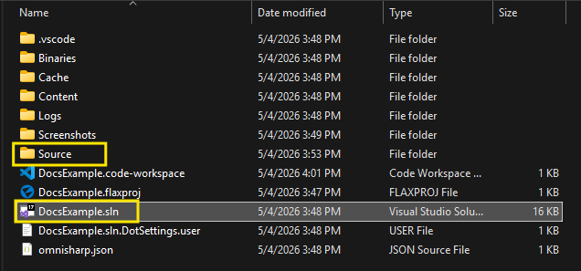
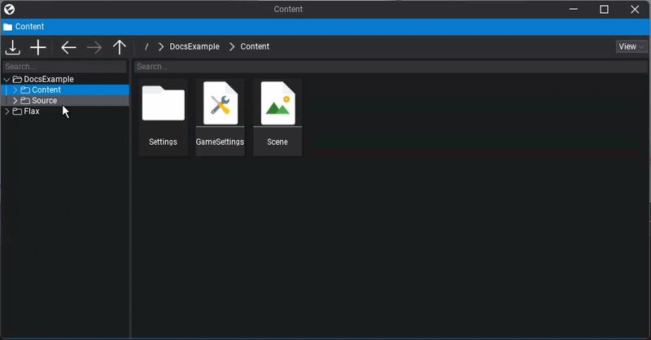
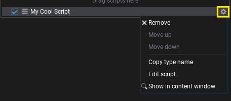
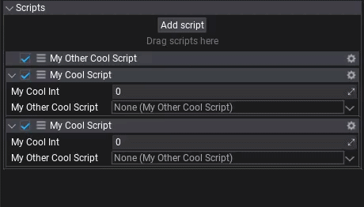

# Create and use a script

> [!Note]
> If you want to use C++ scripting you can find out how [here](cpp/index.md).

Scripts in Flax are written in the **C#** language (source files with extension `.cs`).

For organizational purposes, script files are located in the `Source/` directory of your Flax project.
This nicely separates scripts (logic) from assets (content).

The editor creates a solution (`.sln`) file as well as C# projects (`.csproj`) for game scripts and editor plugins.

In Flax, like in many other engines, scripts are **attached to actors**. Every actor can contain an unlimited amount of individual scripts (including multiple instances of the same script type). This means that the script's lifetime is related to that of the actor. 

# Create a script

1. In the *Content* window, navigate to the *Game module folder* located at *&lt;project_name&gt;/Source/&lt;game_module_name&gt;*.
By default that will be `Source/Game`.

2. Right click in any empty space. Click on `New/C#/C# Script` in the context menu that has appeared to create a new C# script. There are many other templates available, but `C# Script` is the one you will use most commonly. 
  The new script will automatically enter renaming mode after you create it, so you can just type in a name. It is recommended that you give the new script a name, since some of the templates will use as a class name. 
 

3. Double-click the newly created script. Flax will now open it in your IDE. If your IDE isn't open yet, Flax will do that for you as well.

Congratulations! You have now created a new script. Follow this manual to learn how to use a script in your Flax Project or continue on your own if you already know that part. Happy coding :)

# Use a script

1. Select the actor you want to add a script to.
2. Drag and drop the script into the **Drag scripts here** area that shows in the *Properties* panel.

Alternatively you can also:
- Drag a script over an actor in the *Scene* panel.
- Use the "Add script" button in the *Scripts* section shown in the *Properties* panel of the selected actor.
- Use the `AddScript()` method of an `Actor` (not recommended if you just want to attach and use a script normally).

 

Each script is displayed collapsible panel within the `Scripts` section of the *Properties* panel.

It will show public properties and fields by default, but you can further control which members are visible in the *Properties* panel by using various attributes.

Each script panel shows the scripts class type name and a **checkbox to toggle the scripts execution** and **`Enabled` state**.

To **remove**, **edit** or **reorder** a script, use the **settings button** on the right side of the script header, which shows a popup with various options.

You can also easily **pick a reference to a script or reorder it** by simply clicking and dragging the **three-bar icon** as shown on a gif below:

