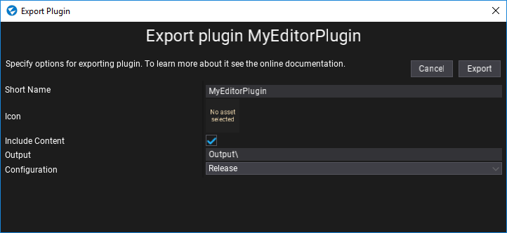
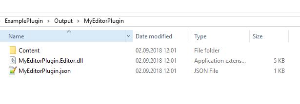

# Plugin Exporting

Once you create your own plugin you can export it and reuse across other projects or distribute. Use this page to learn how to do it.

## Export dialog

Open exporting dialog by using menu item **Tools -> Plugin Exporter**.

Use this dialog to specify the plugin exporting options such as plugin assembly name, plugin icon or output data options.

During plugin exporting plugin source code is compiled like a normal game scripts project but the assembly name is changed from `Assembly` to enter in dialog and the preprocessor variables used to indicate target platform or the environment are changed and the only used is **FLAX_PLUGIN**.

## Output Data

After exporting the plugin the output directory will contain: plugin binaries (*.dll* files), plugin description asset (*.json* file), and plugin content (*Content* folder; if checked to export it).

## Distribution

The exported plugin is very easy to distribute. You can do it manually by copying the plugin files to the target project **Content** subdirectory. Flax will load plugin assemblies and initialize plugins. Then plugin content can be used in the game project.

## Advanced

If you are plugin developer and you need more advanced plugin exporting pipeline you can use `FlaxEditor.Windows.PluginExporterDialog.DoExport` method that can be invoked from editor script code to build the plugin without using UI. This can be useful when implementing more complex build pipelines and testing infrastructures.

