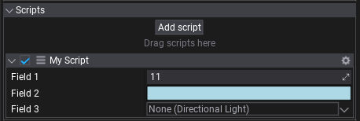
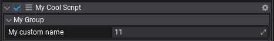

# Script properties and fields

Every script can contain various fields and properties. By default, Flax shows all **public fields and properties** in the *Properties Panel*, allowing the user to modify them on a per script instance there.

# Script

# [C#](#tab/code-csharp)
[!code-csharp[Example1](code-examples/properties.cs)]
# [C++](#tab/code-cpp)
[!code-cpp[Example2](code-examples/properties.h)]
***
<br>



# Attributes

Attributes are a way to customize how a field or property will appear and behave in the *Properties Panel*.

This section will cover the most important attributes to help you get started. To learn more about the various attributes Flax provides or to get a full list of all of the available ones, see this [page](attributes.md).

## Visibility

If you want to **hide** a public property or field, simply put the [`[HideInEditor]`](https://docs.flaxengine.com/api/FlaxEngine.HideInEditorAttribute.html) attribute above it.

# [C#](#tab/code-csharp-hide)
```cs
[HideInEditor]
public int MyPublicButHiddenInt = 11;
```
# [C++](#tab/code-cpp-hide)
```cpp
API_FIELD(Attributes="HideInEditor")
int MyPublicButHiddenInt = 11;
```
***
<br>

You can also make a private field or property visible by adding the [`[ShowInEditor]`](https://docs.flaxengine.com/api/FlaxEngine.ShowInEditorAttribute.html) attribute to it.

# [C#](#tab/code-csharp-show)
```cs
[ShowInEditor]
private int myPrivateButVisibleInt = 11;
```
# [C++](#tab/code-cpp-show)
```cpp
API_FIELD(Attributes="ShowInEditor")
int myPrivateButVisibleInt = 11;
```
***
<br>

Visibility can also be controlled by other boolean fields or properties using the [`[VisibleIf]`](https://docs.flaxengine.com/api/FlaxEngine.VisibleIfAttribute.html) attribute.

# [C#](#tab/code-csharp-visible-if)
```cs
private bool myBoolean = false;

[VisibleIf("myBoolean")] // MyPublicButHiddenInt will be hidden since myBoolean is set to false
public int MyPublicButHiddenInt = 11;
```
***

## Serialization

If you **do not want to serialize** a field or property that would be otherwise serialized by default, use the [`[NoSerialize]`](https://docs.flaxengine.com/api/FlaxEngine.NoSerializeAttribute.html) attribute.

# [C#](#tab/code-csharp-no-serialize)
```cs
[NoSerialize]
public int PublicButNotSerializedInt = 11;
```
# [C++](#tab/code-cpp-no-serialize)
```cpp
API_FIELD(Attributes="NoSerialize")
int PublicButNotSerializedInt = 11;
```
***
<br>

Of course you can also **serialize a property that would not be serialized** by default. To do that, simply apply the [`[Serialize]`](https://docs.flaxengine.com/api/FlaxEngine.SerializeAttribute.html) to it.

# [C#](#tab/code-csharp-serialize)
```cs
[Serialize]
private int privateButSerializedInt = 11;
```
# [C++](#tab/code-cpp-serialize)
```cpp
API_FIELD(Attributes="Serialize")
int privateButSerializedInt = 11;
```
***
<br>

To see when a property or field will be serialized by default, see [the documentation on serialization](serialization/index.md#serialization-rules).

## Expose private members to Properties Panel

It is very common that you need to expose a `private` field or property to the *Properties Panel*. In Flax you can achieve that by adding the [`[ShowInEditor]`](https://docs.flaxengine.com/api/FlaxEngine.ShowInEditorAttribute.html) and [`[Serialize]`](https://docs.flaxengine.com/api/FlaxEngine.SerializeAttribute.html) attributes to it.

## Groups and custom names

Flax supports displaying items in the *Properties Panel* in groups. To add a field or property to a group, use the [`[EditorDisplay]`](https://docs.flaxengine.com/api/FlaxEngine.EditorDisplayAttribute.html). It also allows you to show your property or field under a different name than the name it is declared as.

# [C#](#tab/code-csharp-editor-display)
```cs
[EditorDisplay("My Group", "My custom name")]
public int MyGroupedIntWithCustomName = 11;
```
# [C++](#tab/code-cpp-editor-display)
```cpp
API_FIELD(Attributes="EditorDisplay(\"My Group\", \"My custom name\")")
int MyGroupedIntWithCustomName = 11;
```
***
<br>


If you want the group you declared to be expanded by default, you can add the [`[ExpandGroups]`](https://docs.flaxengine.com/api/FlaxEngine.ExpandGroupsAttribute.html) attribute to your property or field.

## Order

You can modify the order properties or fields appear in when shown in the *Properties Panel* by using the [`[EditorOrder]`](https://docs.flaxengine.com/api/FlaxEngine.EditorOrderAttribute.html).

# [C#](#tab/code-csharp-editor-order)
```cs
[EditorOrder(1)]
public int MyFirstInt = 11;
[EditorOrder(0)]
public int MySecondInt = 11;
```
# [C++](#tab/code-cpp-editor-order)
```cpp
API_FIELD(Attributes="EditorOrder(1)")
int MyFirstInt = 11;
API_FIELD(Attributes="EditorOrder(0)")
int MySecondInt = 11;
```
***
<br>


Properties with a lower index will be displayed first. You can also use a negative index, which can be useful if you are exposing some properties or fields in a base class, but want to be able to start at index `0` again in any inherited class.

Note that properties or fields that have the [`[EditorOrder]`](https://docs.flaxengine.com/api/FlaxEngine.EditorOrderAttribute.html) attributes attached will be displayed *before* any other properties or fields.

## Read only

Sometimes you may want to only show the value of a field or property in the *Properties Panel*, without a way to edit it.

This can be be especially useful for debugging.

To be able to do this, Flax provides the [`[ReadOnly]`](https://docs.flaxengine.com/api/FlaxEngine.ReadOnlyAttribute.html) attribute.

# [C#](#tab/code-csharp-read-only)
```cs
[ReadOnly]
public int ReadOnlyInt = 11;
```
# [C++](#tab/code-cpp-read-only)
```cpp
API_FIELD(Attributes="ReadOnly")
int ReadOnlyInt = 11;
```
***
<br>


## Combining attributes

It is important to mention that often times you will have to combine multiple attributes to get the desired behavior (as seen in the ["Expose private members to Properties Panel" section](#expose-private-members-to-properties-panel)).
