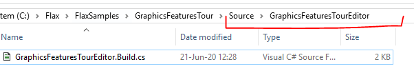

# HOWTO: Add scripts module

When your project sources get bigger or you need separate library in source code you can add more modules to your codebase. For instance, adding separate editor-only module can be used to create scripts just for game and tools in editor but won't be used at runtime in cooked game. You can follow this tutorial if your project does not have scripts modules at all to add the first one.

To learn more about modules and build scripts see documentation page [here](../../editor/flax-build/index.md).

## 1. Create folder and `.Build.cs` file

The first step is to create a new folder for a module scripts `Source/<new_module_name>` directory of your project. Then create there an empty file named `<new_module_name>.Build.cs`.



## 2. Write module build script

Now, setup the module script as an example below. If your module is not editor-only then ensure to inherit from `GameModule` class instead of `GameEditorModule`. You can also set `BuildNativeCode` to `true` if you want to use C++ scripts in your module.

```cs
using Flax.Build;
using Flax.Build.NativeCpp;

public class GraphicsFeaturesTourEditor : GameEditorModule
{
    /// <inheritdoc />
    public override void Setup(BuildOptions options)
    {
        base.Setup(options);

        // Here you can modify the build options for your game module
        // To reference another module use: options.PublicDependencies.Add("Audio");
        // To add C++ define use: options.PublicDefinitions.Add("COMPILE_WITH_FLAX");
        // To learn more see scripting documentation.
        BuildNativeCode = false;

        // Reference game scripts module
        options.PublicDependencies.Add("GraphicsFeaturesTour");
    }
}

```

## 3. Use module

The last step is to add this module into the target build. To do this edit the **Target** build script (eg. `Source/GraphicsFeaturesTourEditorTarget.Build.cs`). In case of game modules add it to game target too so it will work in a game build.

```cs
using Flax.Build;

public class GraphicsFeaturesTourEditorTarget : GameEditorTarget
{
    /// <inheritdoc />
    public override void Init()
    {
        base.Init();

        // Reference the modules for editor
        Modules.Add("GraphicsFeaturesTour");
        Modules.Add("GraphicsFeaturesTourEditor");
    }
}
```

As you can see the new module was added to `Modules` list (by name).
Now you can regenerate scripts project files and start editor to use the scripts in a separate module.
