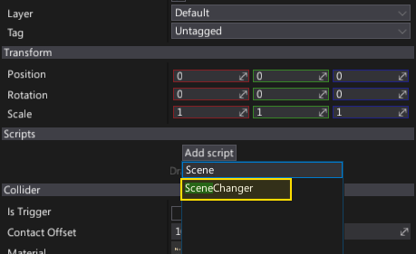
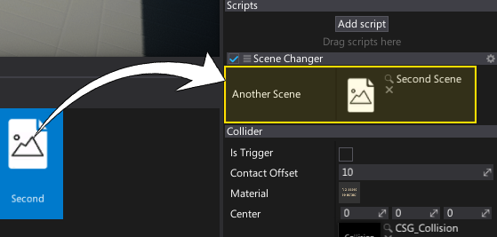

# HOWTO: Change scene from script

In this tutorial you will learn how to unload existing scenes and load different one using C# script.

### 1. Prepare a new script

Navigate to `Source` directory, **right-click**, and select option **New -> Script**. Then specify its name (eg. `SceneChanger`) and hit Enter.

### 2. Implement scene change logic

Here is a sample code that exposes a public variable with a reference to the scene asset to load. It check in Update function if key `G` was pressed, then it changes the current scene into the selected one.

```cs
public class SceneChanger : Script
{
	public SceneReference AnotherScene;

	public override void OnUpdate()
	{
		if (Input.GetKeyDown(KeyboardKeys.G))
			SceneManager.ChangeSceneAsync(AnotherScene);
	}
}
```

### 3. Add script

Now, add the script to the object in your scene (select object and use `Add script` button).



### 4. Assign scene

Then *drag and drop* scene that you want to load from the Content Window into the asset picker.



### 5. Test it out

Finally, hit the play button (or **F5**) and test the script logic but pressing the `G`. Your scene will be unloaded and a new scene will be loaded at runtime.

