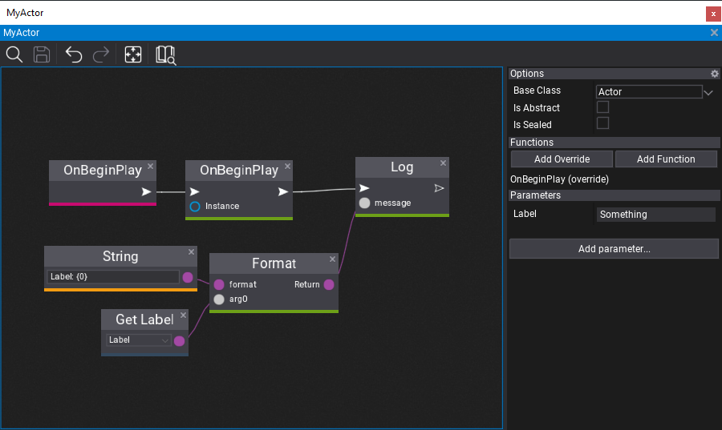

# HOWTO: Create a custom actor type

### 1. Create script

Actors are scene objects just like Scripts and can receive scene graph events such as *OnBeginPlay*, *OnEndPlay*, etc. (remember to always call base method for overriden actor events). In this example we simply use some dummy variables with logging to indicate that actor works.

# [C#](#tab/code-csharp)
```cs
public class MyActor : Actor
{
    public string Label = "Something";

    /// <inheritdoc />
    public override void OnBeginPlay()
    {
        base.OnBeginPlay();

        Debug.Log("Label: " + Label);
    }
}
```
# [C++](#tab/code-cpp)
```cpp
#include "Engine/Core/Log.h"
#include "Engine/Level/Actor.h"

API_CLASS() class GAME_API MyActor : public Actor
{
DECLARE_SCENE_OBJECT(MyActor);

    API_FIELD() String Label = TEXT("Something");

    void OnBeginPlay() override
    {
        Actor::OnBeginPlay();

        LOG(Info, "Label: {0}", Label);
    }
};

inline MyActor::MyActor(const SpawnParams& params)
    : Actor(params)
{
}
```
# [Visual Script](#tab/code-vs)
Create new Visual Script and use **Actor** as a base class. Then override method (eg. OnBeginPlay), right-click on overriden method node and select option **Add base method call** to ensure child actors and scripts will be initialized properly. To use Format method in compact form you can right-click on it and use **Convert to pure node**.


***

### 2. Use actor

The next step is to drahg&drop actor from *Content* window into scene or scene tree. You can also use **Toolbox* window to search for actor type and spawn it from there. You can also create your actor from code in other scripts.

### 3. Extend actor

Editor offers various ways to customize or extend custom actor type.

### Actor creation utility

If you develop 3rd Party SDK plugin or commonly used actor type then you can use `ActorContextMenu` attribute to link it into the Editor's scene/prefab editors.

# [C#](#tab/code-csharp)
```cs
[ActorContextMenu("New/My Actor")]
public class MyActor : Actor
{
...
}
```
# [C++](#tab/code-cpp)
```cpp
API_CLASS(Attributes="ActorContextMenu(\"New/My Actor\")")
class GAME_API MyActor : public Actor
{
...
};
```
# [Visual Script](#tab/code-vs)
***

### Actor with an icon

If you want to attach a simple icon to the actor so it's more visible and usable in Editor viewport then use similar code as follows:

```cs
using FlaxEngine;
#if FLAX_EDITOR
using FlaxEditor;
using FlaxEditor.SceneGraph;
#endif

public class MyActorType : Actor
{
#if FLAX_EDITOR
    static MyActorType()
    {
        ViewportIconsRenderer.AddCustomIcon(typeof(MyActorType), Content.LoadAsync<Texture>("Content/Path/To/TextureAsset.flax"));
        SceneGraphFactory.CustomNodesTypes.Add(typeof(MyActorType), typeof(MyActorTypeNode));
    }
#endif

    /// <inheritdoc />
    public override void OnEnable()
    {
        base.OnEnable();

#if FLAX_EDITOR
        ViewportIconsRenderer.AddActor(this);
#endif
    }
    
    /// <inheritdoc />
    public override void OnDisable()
    {
#if FLAX_EDITOR
        ViewportIconsRenderer.RemoveActor(this);
#endif

        base.OnDisable();
    }
}

#if FLAX_EDITOR
/// <summary>Custom actor node for Editor.</summary>
[HideInEditor]
public sealed class MyActorTypeNode : ActorNodeWithIcon
{
    /// <inheritdoc />
    public MyActorTypeNode(Actor actor)
        : base(actor)
    {
    }
}
#endif
```
