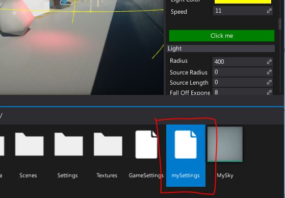
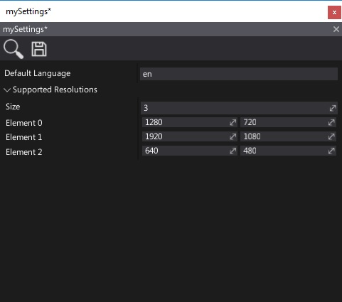
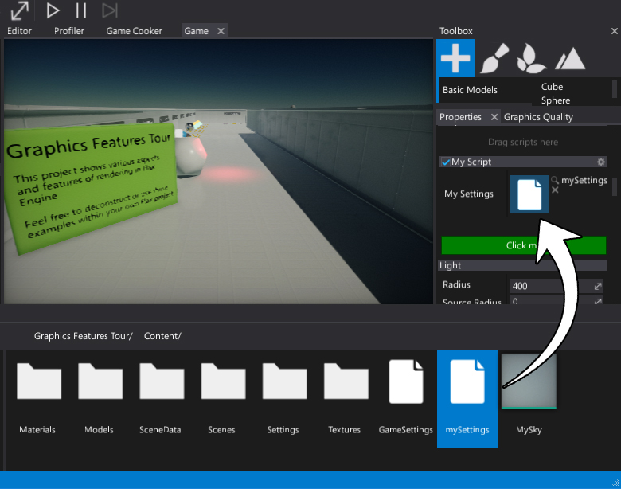

# HOWTO: Create a custom asset type

Flax uses two types of assets:
* **Binary** asset (files with extension `.flax`)
* **Json** assets (files with extension `.json`/`.scene`/etc.)

Binary assets are better choice for textures, models and bigger types in general. While json assets are useful when dealing with data that can be used directly by scripts and scene objects.

In this tutorial you will learn how to define a custom json asset type and use it in your game.

### 1. Define a data class

Implement a class that will define the asset data layout. In this example we store some supported screen resolutions and the default language. Then it will be saved to json and modified in editor. Later game can load asset and use its data.

# [C#](#tab/code-csharp)
```cs
public class MySettings
{
	public Vector2[] SupportedResolutions =
	{
		new Vector2(1280, 720),
		new Vector2(1920, 1080),
	};

	public string DefaultLanguage = "en";
}
```
# [C++](#tab/code-cpp)
```cpp
#pragma once

#include "Engine/Core/ISerializable.h"
#include "Engine/Core/Math/Vector2.h"
#include "Engine/Scripting/ScriptingType.h"

API_CLASS() class GAME_API MySettings : public ISerializable
{
    API_AUTO_SERIALIZATION();
    DECLARE_SCRIPTING_TYPE_NO_SPAWN(MySettings);

    API_FIELD()
	Array<Vector2> SupportedResolutions = { Vector2(1280, 720), Vector2(1920, 1080) };

    API_FIELD()
	String DefaultLanguage = TEXT("en");
};
```
***

Add this class to game scripts assembly. It can be in editor scripts assembly but then it will be design-time only.

### 2. Create an asset

Next step is to create an actual asset (*.json* file) that contains settings.
In project *Content* use *right-click* and use option **New -> Json Asset**.
Then specify it's name and pick the type to created class typename (in this example it's `MySettings`).
Press **Create** button to make a file with default values of the type.


Also, you can use [Custom Editor](custom-editor.md) or [Custom Window](custom-window.md) or just [editor-only code](../preprocessor.md) to spawn a new asset in editor.

```cs
[CustomEditor(typeof(MyScript))]
public class MyScriptEditor : GenericEditor
{
	public override void Initialize(LayoutElementsContainer layout)
	{
		base.Initialize(layout);

		layout.Space(20);
		var button = layout.Button("Click me", Color.Green);
		button.Button.Clicked += OnButtonClicked;
	}

	private void OnButtonClicked()
	{
		// Create json asset
		FlaxEditor.Editor.SaveJsonAsset("Content/mySettings.json", new MySettings());
	}
}
```

After selecting the script and pressing the custom editor button the asset appears in the *Content* folder.



### 3. Edit asset in editor

Double-click on created asset. Dedicated editor window will pop up. Use it to modify the asset and press `Save` button to save the data.



Json asset file contents:

```json
{
	"ID": "a71da43c4c1905f17c1104978df8070f",
	"TypeName": "MySettings",
	"EngineBuild": 6147,
	"Data": {
	"SupportedResolutions": [
		{
			"X": 1280.0,
			"Y": 720.0
		},
		{
			"X": 1920.0,
			"Y": 1080.0
		},
		{
			"X": 640.0,
			"Y": 480.0
		}
	],
	"DefaultLanguage": "en"
}
}
```

### 4. Use asset in game

Using json asset works the same in editor and in built game. The difference is that during game cooking json assets are compressed and encrypted so data is secure.

To use this asset simply add [JsonAsset](https://docs.flaxengine.com/api/FlaxEngine.JsonAsset.html) reference to your script and drag and drop the `mySettings.json` asset to it.

# [C#](#tab/code-csharp)
```cs
public class MyScript : Script
{
	public JsonAsset MySettings;

	public override void OnStart()
	{
		if (MySettings)
		{
			var obj = (MySettings)MySettings.Instance;
			Debug.Log("Default language: " + obj.DefaultLanguage);
		}
	}
}
```
# [C++](#tab/code-cpp)
```cpp
#pragma once

#include "Engine/Scripting/Script.h"
#include "Engine/Core/Log.h"
#include "Engine/Content/AssetReference.h"

API_CLASS() class GAME_API MyScript : public Script
{
    API_AUTO_SERIALIZATION();
    DECLARE_SCRIPTING_TYPE(MyScript);

    API_FIELD() AssetReference<JsonAsset> MySettings;

    // [Script]
    void OnStart() override
    {
        const auto obj = MySettings ? MySettings->GetInstance<::MySettings>() : nullptr;
        if (obj)
        {
            LOG(Info, "Default language: {0}", obj->DefaultLanguage);
        }
    }
};

inline MyScript::MyScript(const SpawnParams& params)
    : Script(params)
{
}
```
***



## Asset creation utility

If you develop 3rd Party SDK plugin or commonly used asset type then you can use `ContentContextMenu` attribute to link it into the Editor's Content window.

# [C#](#tab/code-csharp)
```cs
[ContentContextMenu("New/My Settings")]
public class MySettings
{
...
}
```
# [C++](#tab/code-cpp)
```cpp
API_CLASS(Attributes="ContentContextMenu(\"New/My Settings\")")
class GAME_API MySettings : public ISerializable
{
...
};
```
***

## Asset extenion in Editor

Flax Editor supports extending editing and usage experience per-asset type. For example, you can override the default asset icon, generate a thumbnail based on contents or provide additional actions executable from *Content* window.

Example C# code for Editor extending the `MySettings` asset:

```cs
public class MySettingsItem : JsonAssetItem
{
    /// <inheritdoc />
    public MySettingsItem(string path, Guid id, string typeName)
    : base(path, id, typeName)
    {
        // Use custom icon (Sprite)
        _thumbnail = Editor.Instance.Icons.Document128;
    }
}

[ContentContextMenu("New/My Settings")]
public class MySettingsProxy : SpawnableJsonAssetProxy<MySettings>
{
    /// <inheritdoc />
    public override AssetItem ConstructItem(string path, string typeName, ref Guid id)
    {
        // Use custom type of the Asset Item for editor
        return new MySettingsItem(path, id, typeName);
    }
}
```

You can easily customizable proxy methods by overriding them.

Then register custom asset proxy within [Editor plugin](custom-plugin.md) initialization (ensure to remove it on game code unloading - eg. during script hot-reload in Editor):

```cs
Editor.Instance.ContentDatabase.Proxy.Add(new MySettingsProxy());
```
