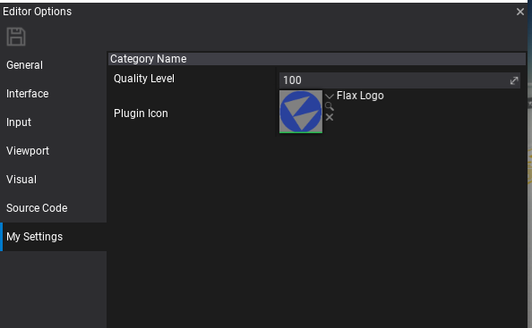

# HOWTO: Create a custom editor settings

In this tutorial you will learn how to extend the default editor settings.

### 1. Prepare

In most cases, additional editor settings are used by the editor plugins. To learn how to create own see [this tutorial](custom-plugin.md). However, you can access the editor options from any C# code running in the editor (including scripts). Using `FLAX_EDITOR` define can help you to include editor-related code into the game scripts.

### 2. Create settings object

The first step is to design the data container for your options. To do so simply create a C# class that contains all required properties. This object is used for options serialization and editing in options window so you can use Custom Editors attributes such as `Tooltip`.

Example options:

```cs
public class MySettings
{
    [EditorOrder(0), EditorDisplay("Category Name"), Limit(0), Tooltip("Helper tooltip")]
    public float QualityLevel = 100;

    [EditorOrder(10), EditorDisplay("Category Name"), Tooltip("Texture property")]
    public Texture PluginIcon;
}
```

### 3. Setup options

The next step is to inform Flax Editor about your settings type. This can be done via dedicated Editor C# API that handles custom settings.

```cs
public class MyCustomPlugin : EditorPlugin
{
    public static readonly string SettingsType = "My Settings";

    /// <inheritdoc />
    public override void InitializeEditor()
    {
        base.InitializeEditor();

        // Register custom options factory
        Editor.Options.AddCustomSettings(SettingsType, () => new MySettings());

        // You can register for event to track settings being edited by user
        Editor.Options.OptionsChanged += OnOptionsChanged;
    }

    private void OnOptionsChanged(EditorOptions options)
    {
        // Use helper method to access the data
        var customOptions = options.GetCustomSettings<MySettings>(SettingsType);
        Debug.Log("Options: " + customOptions.QualityLevel);
    }

    /// <inheritdoc />
    public override void DeinitializeEditor()
    {
        // Ensure to cleanup on plugin shutdown
        Editor.Options.OptionsChanged -= OnOptionsChanged;
        Editor.Options.RemoveCustomSettings(SettingsType);

        base.DeinitializeEditor();
    }
}
```

### 4. Test it out!

Now, in editor and use main menu option **Tools -> Options** and pick you settings category.



