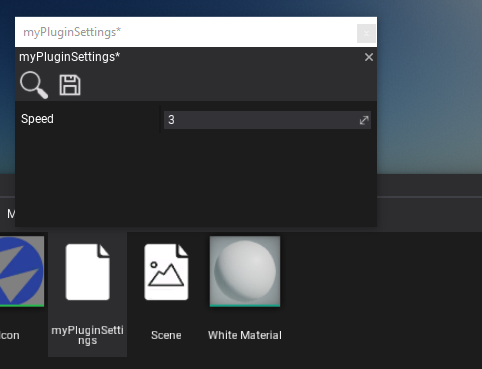

# HOWTO: Use Custom Settings

**Custom Settings** are the easiest way to extend the default game configuration by adding own data components that define the game configuration. Also, it's a very unified way for plugins to inject custom options into the game. In this tutorial, you will learn how to define, create and use custom settings right in your game or a plugin.

To learn more about custom settings see related page [here](../../editor/game-settings/custom-settings.md).

### 1. Define custom settings data object

The first step is to prepare the actual layout for the custom settings.
Flax uses C# objects that are a very good way to define data, serialize, and access from C# code.
Here is a sample class that defines a set of settings used by the example game. Create this class in your game project (Assembly project).

```cs
public class MySettings
{
	public float Speed = 2.0f;
}
```

### 2. Create settings in Editor

Next step is to create an actual asset (*.json* file) that contains settings. You can use you script code (Start method), a [custom editor](custom-editor.md), or a [custom editor window](custom-window.md) to do it.

```cs
#if FLAX_EDITOR
	var path = Path.Combine(Globals.ContentFolder, "mySetitng.json");
	FlaxEditor.Editor.SaveJsonAsset(path, new MySettings());
	GameSettings.SetCustomSettings("MyPlugin", Content.LoadAsync<JsonAsset>(path));
#endif
```

The sample code creates a new settigns asset in Content folder named *myPluginSettings.json*.

Note: if you are developing a plugin you can create a default plugin settings asset and ship it with the plugin so it can be used to adjust plugin options in the project that uses it.

### 3. Edit settings in Editor

Now you can use Flax Editor to open and edit the settings. Simply **double click on an asset in the Content Window** to open the editor window and modify the settings.



### 4. Access settings at runtime

Custom Settings can be accessed at runtime via `Application.GetCustomSettings` method that returns the `JsonAsset` linked by the given key (this example code uses key *MyPlugin*).

```cs
var settings = Application.GetCustomSettings("MyPlugin");
if (settings)
{
    Debug.Log("Settings: " + settings.CreateInstance<MySettings>().Speed);
}
```
