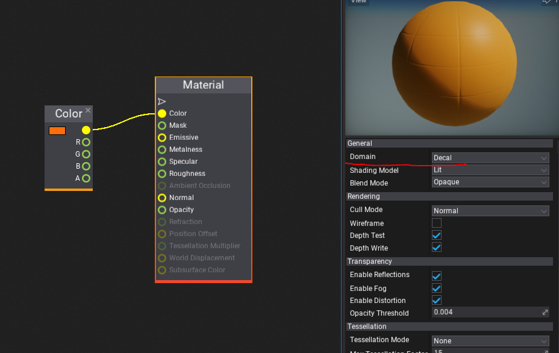
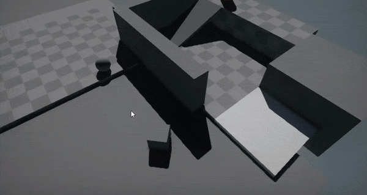

# HOWTO: Spawn decals on mouse click

### 1. Create decal material

Firstly, create or use your decal material. Ensure to set the **Domain** to **Decal**.



### 2. Create script

Create a new script and add code that performs the physics collision raycast without the scene and spawns the decal actor on the result hit location.

```cs
public class MouseShoot : Script
{
    public MaterialBase DecalMaterial;

    public override void OnUpdate()
    {
        if (Input.GetMouseButtonDown(MouseButton.Left))
        {
            var pos = Input.MousePosition;
            var ray = Camera.MainCamera.ConvertMouseToRay(pos);
            if (Physics.RayCast(ray.Position, ray.Direction, out var hit))
            {
                var decal = Scene.AddChild<Decal>();
                decal.Position = hit.Point;
                decal.Material = DecalMaterial;
                decal.Direction = hit.Normal;
            }
        }
    }
}
```

### 3. Test it out!

Finally, add the script to any actor on the scene and plug created material to script **Decal Material** property. Then start the game and test the result.




