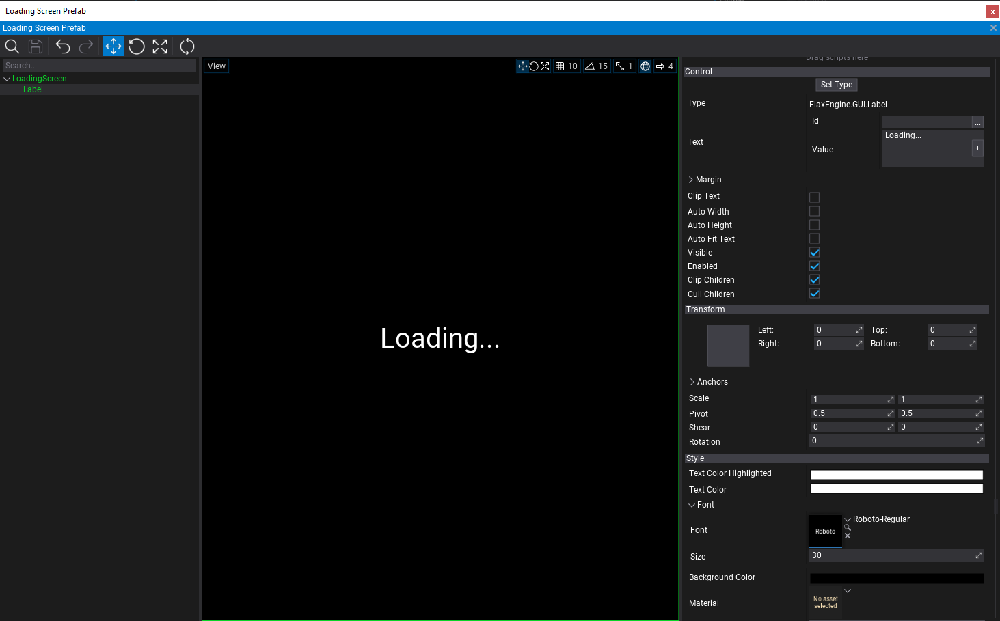
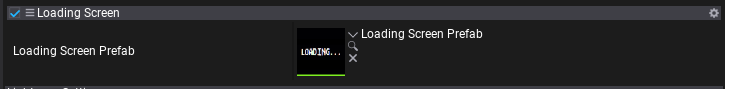

# HOWTO: Create Loading Screen

When changing maps in a game it often requries few seconds to load all assets and stream the textures/models/audio qualtiy to a desire quality level. The common technique is to show a loading screen during this loading process. In this tutorial you will learn how to use Flax API to read the current assets and streaming stats and display loading screen based on it.

### 1. Create script for loading screen control

The first step is to create new script (named `LoadingScreen`) that will be responsible for displaying loading screen UI once the new map starts to load and will hide it when map is loaded.

```cs
using System;
using FlaxEngine;

public class LoadingScreen : Script
{
    private Actor _loadingScreen;

    /// <summary>
    /// The loading screen prefab with UI.
    /// </summary>
    public Prefab LoadingScreenPrefab;

    /// <summary>
    /// Returns true if any asset is during loading or streaming.
    /// </summary>
    public bool IsLoading => Content.Stats.LoadingAssetsCount + Streaming.Stats.StreamingResourcesCount != 0;

    /// <summary>
    /// Returns true if loading screen is now visible (can be used to disable player logic during loading screen).
    /// </summary>
    public bool IsShowing => _loadingScreen;

    /// <summary>
    /// Occurs when loading screen gets shown.
    /// </summary>
    public event Action Shown;

    /// <summary>
    /// Occurs when loading screen gets hidden.
    /// </summary>
    public event Action Hidden;

    /// <inheritdoc/>
    public override void OnEnable()
    {
        // Show loading screen when map gets opened
        ShowLoadingScreen();
    }

    /// <inheritdoc/>
    public override void OnUpdate()
    {
        // Hide loading screen when content is loaded
        if (IsShowing && !IsLoading)
            HideLoadingScreen();
    }

    /// <inheritdoc/>
    public override void OnDisable()
    {
        // Ensure to hide loading screen when map gets unloaded
        HideLoadingScreen();
    }

    private void ShowLoadingScreen()
    {
        if (_loadingScreen)
            return;
        Debug.Log("ShowLoadingScreen");
        if (LoadingScreenPrefab == null)
        {
            Debug.LogError("Missing Loading Screen Prefab");
            return;
        }

        // Spawn loading screen
        _loadingScreen = PrefabManager.SpawnPrefab(LoadingScreenPrefab);

        Shown?.Invoke();
    }

    private void HideLoadingScreen()
    {
        if (!_loadingScreen)
            return;
        Debug.Log("HideLoadingScreen");

        // Cleanup
        Destroy(ref _loadingScreen);

        Hidden?.Invoke();
    }
}
```

### 2. Create Loading Screen prefab with UI

Next step is to create a loading screen prefab with Ui that will be displayed on top of the game while it's being loaded.

Steps:
* Add **UI Canvas** to a scene
* Rename it to `LoadingScreen`
* Change `Order` to a higher value eg. *10000*
* Add **UI Control** as a child to canvas
* Use `Set Type` button and change control to **Label**
* Set [Anchors](../../ui/control/transform.md) to `Stretch All` with *Shift* key pressed so it fill the whole screen
* Set Text to `Loading...` via Value field (can be localized later)
* Adjust the font and other properties
* Set **Background Color** to solid black
* Drag&drop the canvas actor into *Content* to **create prefeb out of it**
* Remove it from the scene (it will be spawned from code)

The result of those steps is a prefab with UI Canvas and UI Conrol that displays the loading screen image. Later you can futher customize it by adding loading progress bar or other loading indication throbber. It could be also customizable per-map to display different background image or some gameplay tooltips.



### 3. Setup loading scene script

Now you can use created script and prefab to be added to a main maps (exluding streaming levels or sublevels). Simply select Scene actor and add this script to it. Then link the prefab to a script property.



### 4. Play test

The last step is to play test the created loading screen. When playing game in editor or in build it will display loading screen after map change and hide it once all assets are loaded and resources streamed in.

Finally see `Content.Stats` and `Streaming.Stats` to learn more about loading progress state checking.

> [!Note]
> In Editor loading screen might not show or be visible for a very short time because Editor already has loaded assets when starting play-mode.
