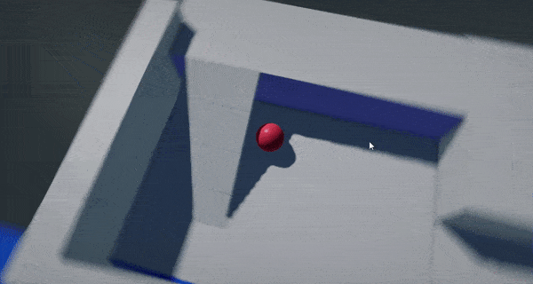

# HOWTO: Create Spring Arm camera

### 1. Create script

Firstly, create a new script and add code that reads mouse input to rotate camera and performs the physics collision raycast to adjust camera placement (prevent intersecting with world collisions).

```cs
/// <summary>
/// Arc-ball 3rd person-style camera controller script that handles collisions with world.
/// </summary>
public class SpringArmCamera : Script
{
    private Float2 _mouse = new Float2(45, 45);

    /// <summary>
    /// Target actor to follow.
    /// </summary>
    public Actor TargetActor;

    /// <summary>
    /// Target camera actor.
    /// </summary>
    public Camera CamerActor;

    /// <summary>
    /// Initial spring arm radius to roam around.
    /// </summary>
    public float Distance = 1000;

    /// <summary>
    /// The minimum distance for spring arm correction.
    /// </summary>
    public float MinDistance = 10.0f;

    /// <summary>
    /// The maximum distance for spring arm correction.
    /// </summary>
    public float MaxDistance = 2000.0f;

    /// <summary>
    /// Mouse movement speed scale.
    /// </summary>
    public float MouseSpeed = 0.5f;

    /// <summary>
    /// Mouse wheel movement speed scale.
    /// </summary>
    public float MouseWheelSpeed = 1.0f;

    /// <summary>
    /// The physics layers that with which spring arm will collide.
    /// </summary>
    public LayersMask CollisionLayers = LayersMask.Default;

    /// <summary>
    /// The additional distance to apply when colliding with geometry in order to prevent camera intersecting with it.
    /// </summary>
    public float CollisionDistanceBias = 10.0f;
    
    /// <inheritdoc />
    public override void OnStart()
    {
        // Auto-link actors
        if (!TargetActor)
            TargetActor = Actor;
        if (!CamerActor)
        {
            CamerActor = Scene.FindActor<Camera>();
            if (CamerActor == null)
                Debug.LogError("Missing camera");
        }
    }

    /// <inheritdoc />
    public override void OnUpdate()
    {
        if (!CamerActor || !TargetActor)
            return;

        // Update input
        _mouse += Input.MousePositionDelta * MouseSpeed;
        _mouse.Y = Mathf.Clamp(_mouse.Y, -89, 89);
        Distance += Input.MouseScrollDelta * -20.0f * MouseWheelSpeed;
        Distance = Mathf.Clamp(Distance, MinDistance, MaxDistance);

        // Update arc-ball camera
        Quaternion rotation = Quaternion.Euler(-_mouse.Y, _mouse.X, 0);
        Vector3 targetPosition = TargetActor.Position;
        Vector3 direction = Vector3.Transform(Vector3.Forward, rotation) * Distance;
        Vector3 newPosition = targetPosition + direction;
        direction = (newPosition - targetPosition).Normalized;
        CamerActor.Position = targetPosition + direction * Distance;
        CamerActor.LookAt(targetPosition, Vector3.Up);
        
        // Snap Camera if it intercepts with an environment
        if (Physics.RayCast(targetPosition, direction, out RayCastHit hit, Distance, CollisionLayers))
        {
            var bias = CollisionDistanceBias + CamerActor.NearPlane;
            var distance = Mathf.Max(hit.Distance - bias, MinDistance);
            CamerActor.Position = targetPosition + direction * distance;
        }
    }
}
```

### 2. Setup

Add script to the player actor and optionally link the camera actor to control. Otherwise script will pick the first camera it founds on a scene.

### 3. Test it out!

Finally, start the game and test the result.


