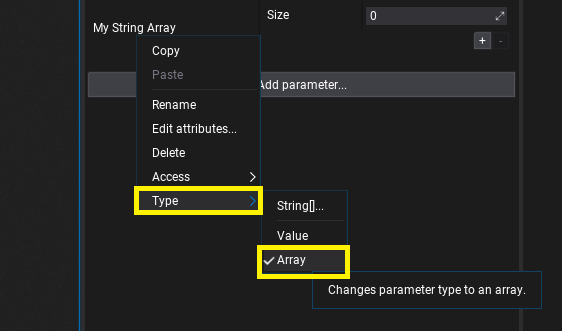
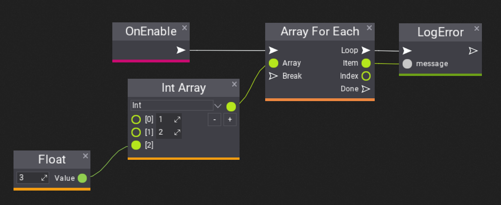
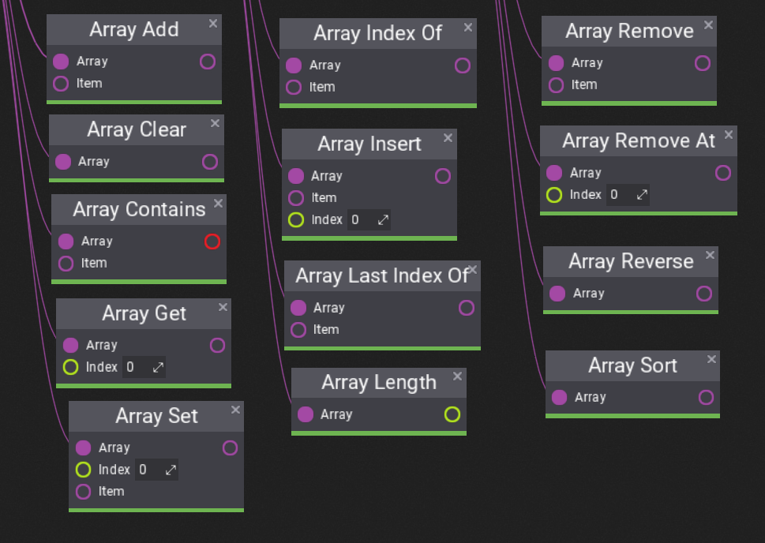

# Arrays in Visual Scripts

**Visual Scripting** supports arrays as script properties and using them in the script to process larger amount of data. Follow this documentation page to learn how to use them in your project.

## How to add array property?

Array properties work just like any other script properties. To create one simple add a variable of a given type eg. `Float` and then use *right-click* to select **Type -> Array**. This will convert property from a single value into an array. You can use this context menu to change it back or to modify the property type.

## How to iterate over array?

To iterate over array you can use in-built **Array For Each** node that allows to iterate over all array items as shown above. It works similar to **For Loop**, except adapts to the array length and exposes current *Item* at the iterator *Index*. To iterate over custom range of array use For Loop or While Loop.

## How to access array?

Group **Array** contains lots of nodes such as: Length, Get, Set, Remove, Sort, etc. Those nodes are generic to all array types but adapt to the input array type. They don't edit referenced input array but return the modified array value (see unnamed output box).

## How to make array value?

Use **Array** from **Constants** group, assign item type, specify the length (with `+` and `-` buttons) and fill with the values.
