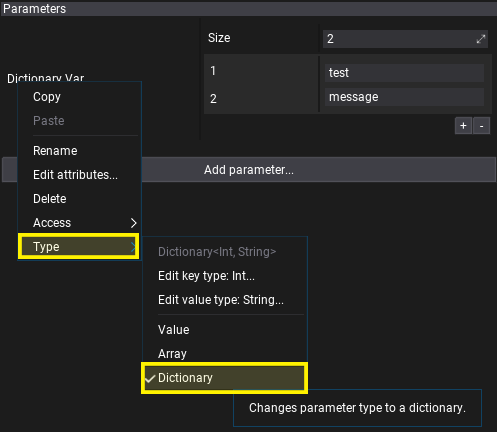
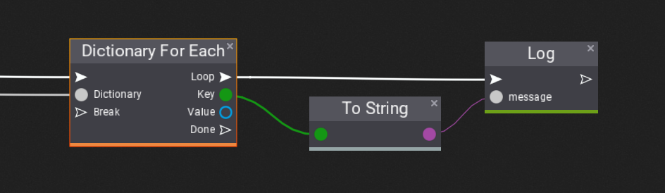
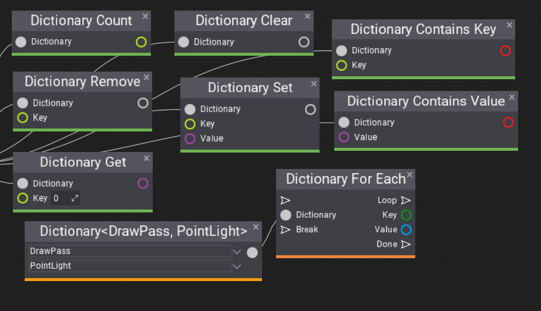

# Dictionaries in Visual Scripts

**Visual Scripting** supports dictionaries as script properties and using them in the script. Dictionaries are useful to map specific keys with values as pairs. This can be used to make configurations (eg. different material per enemy type) or to cache data. Follow this documentation page to learn how to use them in your project.

## How to add dictionary property?

Dictionary properties work just like any other script properties. To create one simple add a variable of a given type eg. `Float` and then use *right-click* to select **Type -> Dictionary**. This will convert property from a single value into a dictionary. You can use this context menu to change it back or to modify the dictionary Key or Value types.

## How to iterate over dictionary?

To iterate over dictionary you can use in-built **Dictionary For Each** node that allows to iterate over all dictionary items as shown above. It works similar to **For Loop**, except adapts to the dictionary contents and exposes current *Key* and *Value* at each iterator step.

## How to access dictionary?

Group **Dictionary** contains lots of nodes such as: Count, Get, Set, Remove, etc. Those nodes are generic to all dictionary types but adapt to the input dictionary type. They don't edit referenced input dictionary but return the modified dictionary value (see unnamed output box).

## How to make dictionary value?

Use **Dictionary** from **Constants** group, assign key and value types and fill with the values using **Dictionary Set** node.
