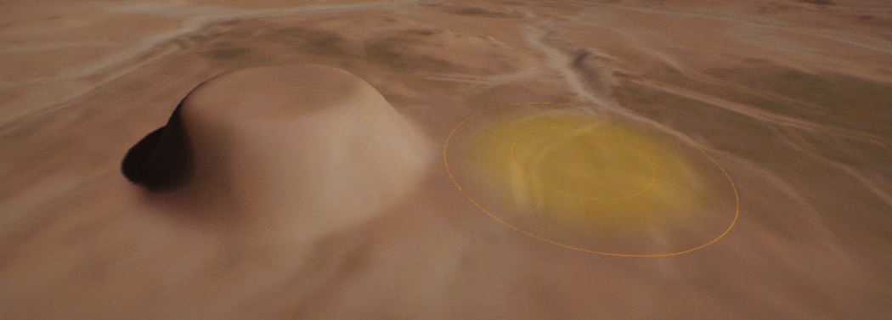
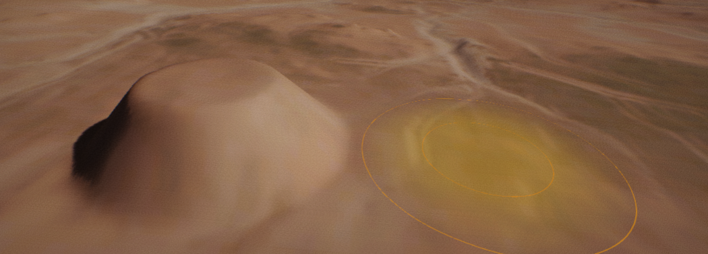
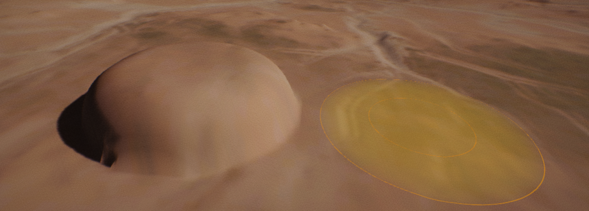
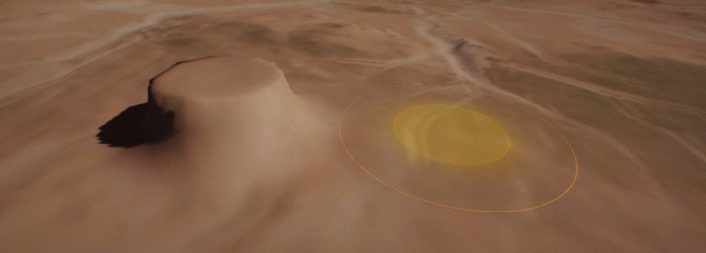

# Terrain Brushes

Flax supports editing and painting terrain using various brushes to easily achieve desired effects right in the editor. Use this documentation page to learn more about brush types supported by Flax.

> [!Note]
> Hold **Shift** key and use `Mouse Scroll Wheel` to control brush size.

## Circle Brush

**Circle Brush** is a default terrain brush that has circle shape and uses radial falloff. It supports various falloff modes to create interesting results with it.

| Property | Description |
|--------|--------|
| **Size** | The brush size (in world units). Within this area, the brush will have at least some effect. |
| **Falloff** | The brush falloff that defines the percentage from the brush's extents where the falloff should begin. Essentially, this describes how hard the brush's edges are. A falloff of 0 means the brush will have full effect throughout with hard edges. A falloff of 1 means the brush will only have full effect at its center, and the effect will be reduced throughout its entire area to the edge. |
| **Falloff Type** | The brush falloff type. Defines circle brush falloff mode. See example images below with falloff types. |

### Smooth Falloff

A linear falloff that has been smoothed to round off the sharp edges where the falloff begins and ends.

### Linear Falloff

A sharp linear falloff, without rounded edges.

### Spherical Falloff

A half-ellipsoid-shaped falloff that begins smoothly and ends sharply.

### Tip Falloff

A falloff with an abrupt start and a smooth ellipsoidal end. The opposite of the Sphere falloff.

