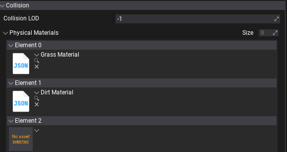

# Terrain Collision

Terrain uses heightfield collider per terain patch. You can specify the **Collision LOD** that can be used to reduce collision quality but improve simulation performance due to lower resolution of the heightfield. Each terrain can have a custom physical material and use heightmap holes mask to create caves and tunnels under the terrain.

If your game uses runtime-generated terrain then ensure to enable **Support Cooking At Runtime** option in Physics Settings to support generating heightfield data at runtime.

## Physical Materials

Terrain supports up to 8 different physical materials assigned for each Terrain Layer - can reflect material appearance.
