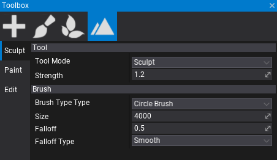
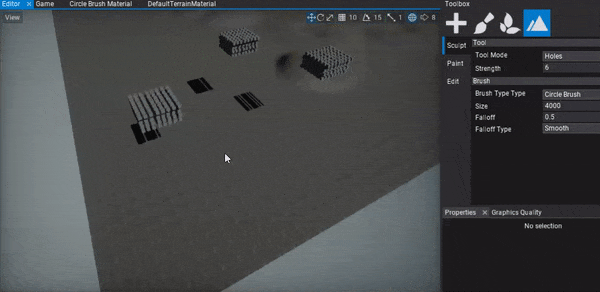
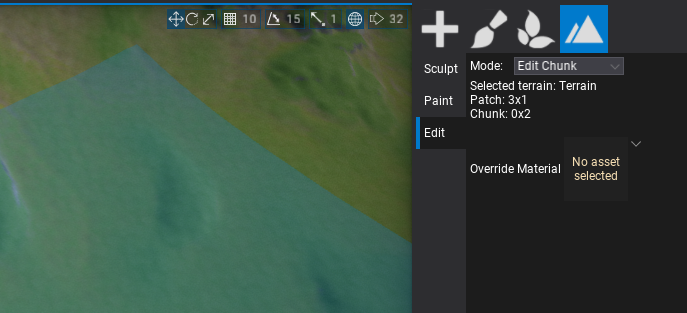

# Terrain Editing

Flax supports editing terrain geometry right inside the editor. After you [create](tutorials/create-terrain.md) or [import](tutorials/import-terrain.md) terrain you can select it and use **Landscape** tab in a **Toolbox** window to modify the terrain. It supports 3 working modes: **Sculpt**, **Paint** and **Edit**.

## Sculpt Mode

Terrain heightmap editing using **Sculpt** tool allows to create mountains, hills, valles and any other landscape shapes with a brush. This tool offers various editing modes descrided below. Select a desire tool mode, edit strength and other mode properties and edit terrain with your brush.

### Sculpt

Sculpt tool mode edits terrain heightmap by moving area affected by brush up or down. **Strength** parameter defines the brush intensity of the applied changes to the terrain.

> [!Note]
> Hold **Control** key to invert brush effect (eg. substract terrain height).

### Smooth

Sculpt tool mode that smooths the terrain heightmap area affected by brush. Alongside the **Strength** parameter that defines the smoothing intensity, you can adjust the smoothing filter radius. **Filter Radius** property defines the size of the smoothing kernel, the higher value the more nearby samples is included into normalized sum. Scaled by the brush size.

## Flatten

Sculpt tool mode that flattens the terrain heightmap area affected by brush to the target value. Use **Strength** parameter to define the blending intensity from the source height to target height. **Target Height** parameter defines the *destination* height for the terrain under the brush. If you use **Control** key it will pick the target height level at the center of the brush so it's easier to flatten the terrain to match the given area level.

## Noise

Sculpt tool mode that applies the noise to the terrain heightmap area affected by brush. The noise **Strength** parameter defines inetsnity of the noise blending. **Noise Scale** can be used to adjust the noise pattern scale and **Noise Amount** controls the amplitude of the noise (in world units).

The current implementation uses Perlin Noise for terrain heightmap perturbation.

## Holes

Terrain holes creating tool mode edits terrain holes mask by changing area affected by brush. Use it to add holes to the heightam or hold **Control** key to remove them.

To learn more about using holes in your terrain see [this tutorial](tutorials/terrain-holes.md).

### Brush

To learn more about using terrain brushes see the related documentation page [here](brushes.md).

## Edit Mode

Terrain heightmap editing using **Edit** tool allows to add or remove terrain patch and modify single terrain chunk properties. Use it to expand your terrain or remove unused terrain parts. Also, using *Edit Chunk* mode you can pick a single terrain chunk, view its location and override the material.

