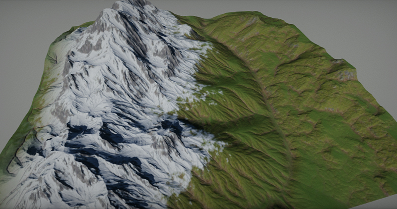

# Terrain

Flax supports high-quality terrain rendering and provides various tools for importing creating and editing landscape. It enables you to create realistic looking outdoor scenes full of mountains, valleys with caves. Use this documentation section to learn how to create your terrain and edit it to create great visual experience.

## Basics

To learn how to create and use terrain in your games please read the [tutorials section](tutorials/index.md). It provides a solid introduction into the terrain system and contains explanation with usage example of all features.

## Technical Details

Terrain is using **Continous LOD** system with streaming which enables to create very large landscapes and render them at high view distances with no performance drop. Under the hood, Terrain actor uses a collection of patches. **Terrain patch** is a part of terrain that contains a quad of 4x4 chunks. **Terrain chunk** is part of the patch and uses it's heightmap and collision. The reason to divide patches into chunks is that engine can apply smooth LOD transitions and cull terrain more efficently. Also every chunk can have custom material for rendering to provide more ease of use when creating complex terrains. Size of the chunk is adjustable per terrain and by default, we use the value of 127. This allows Flax to efficiently cull and draw only visible chunks with smooth LODs transitions (no cracks or visual artifacts on different LOD edges).

Terrain can be imported from external tools (such as World Creator) as a heightmap with a collection of splatmaps or created right in the Editor using the terrain sculpting tools. Flax Editor support using simple carving brush, smoothing brush, noise brush, and flatten brush. Full undo-redo support and intuitive editing tools make it very nice to modify the terrain right inside the editor. Flax supports also creating holes in terrain for caves and tunnels (including proper collisions handling).

Flax supports **up to 8 weights for terrain layers**. This means that developers can blend between many materials to create realistic terrain. Each weight is stored in a separate texture channel (up to 2 splatmaps) and can be sampled in terrain shaders to blend between custom layers. Each terrain chunk can override default terrain the material so there is no limit in texturing advanced landscapes. We use also a more optimize terrain material shader type that is well suited for performant terrain rendering. Also, it supports *tessellation* and full *PBR*.

## In this section

* [Terrain Materials](materials.md)
* [Terrain Editing](editing.md)
* [Terrain Painting](painting.md)
* [Terrain Brushes](brushes.md)
* [Terrain Collision](collision.md)
* [Importing Terrain](importing.md)
* [Terrain Holes](holes.md)

## Tutorials

* [How to create terrain](tutorials/create-terrain.md)
* [How to import terrain](tutorials/import-terrain.md)
* [How to create terrain material](tutorials/terrain-material.md)
* [How to create terrain from code](tutorials/terrain-from-code.md)
* [How to create holes in terrain](tutorials/terrain-holes.md)
* [How to add tessallation to terrain](tutorials/tessellation-and-terrain.md)
