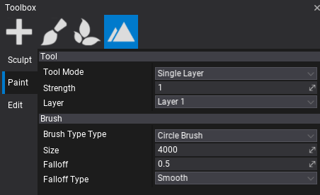

# Terrain Painting

Flax supports editing terrain layer weights right inside the editor. After you [create](tutorials/create-terrain.md) or [import](tutorials/import-terrain.md) terrain you can select it and use **Landscape** tab in a **Toolbox** window to modify the terrain. It supports 3 working modes: **Sculpt**, **Paint** and **Edit**.

## Paint Mode

Terrain heightmap editing using **Paint** tool allows painting terrain with a single texture or whole materials. All you need is prepare a material that uses a terrain layer weights and paint. This tool offers various editing modes described below. Select a desire tool mode, edit strength and other mode properties and edit terrain with your brush.

To learn more about creating terrain materials see [this tutorial](tutorials/terrain-material.md).

### Single Layer

Paint tool mode that edits terrain splatmap by painting with the single layer on top of the others. **Strength** parameter defines the brush intensity of the applied changes to the terrain. **Layer** parameter specified which layer is in use during painting.

### Brush

To learn more about using terrain brushes see the related documentation page [here](brushes.md).
