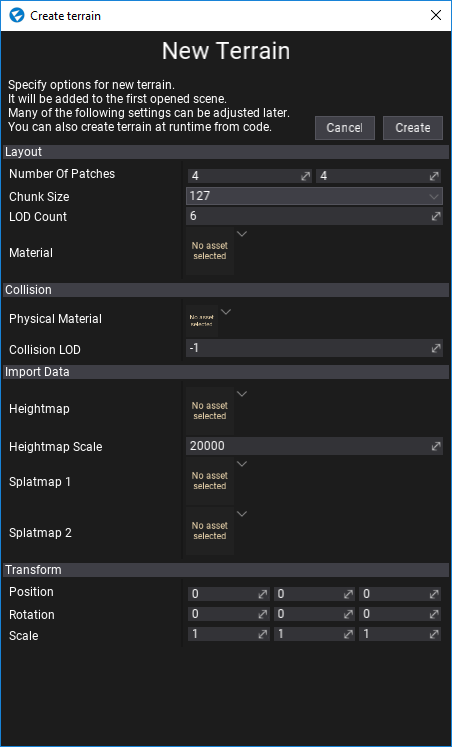
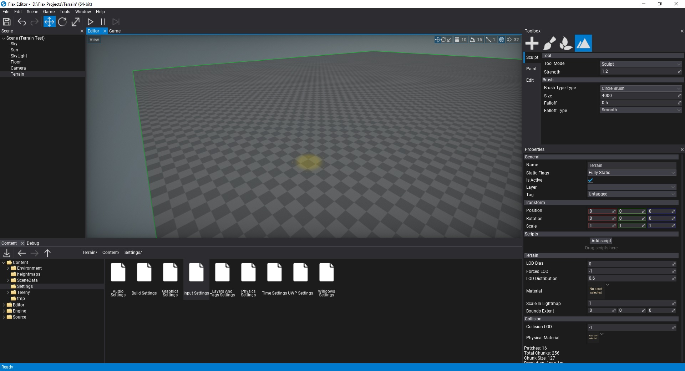

# HOWTO: Create terrain

In this tutorial you will learn how to create a flat terrain and add it to your scene.

## 1. Open scene

Create or open existing level to add new terrain to it. Flax supports many terrains per scene so there is no limit.

## 2. Open terrain creator dialog

Use Main Menu button **Scene -> Create terrain**.

## 3. Adjust options

Use this dialog to adjust the initial terrain properties. Select **chunk size** and amount of **patches** to create. Most of the following properties can be adjusted later. This window supports creating terrain from imported heightmaps and splatmaps as shown in [this tutorial](import-terrain.md).

## 4. Create terrain

Press **Create** button and see new terrain added to your scene. Now you can [edit](../editing.md) and [paint](../painting.md) it!

