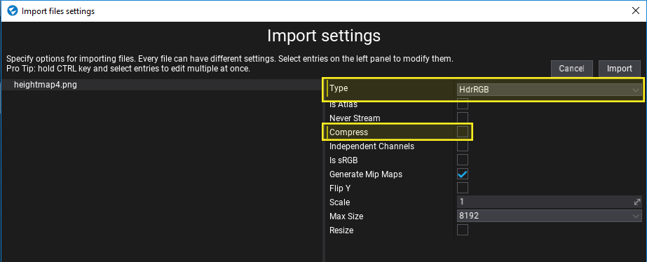
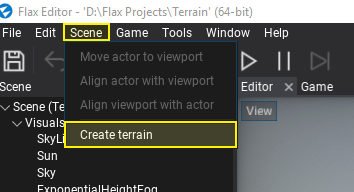
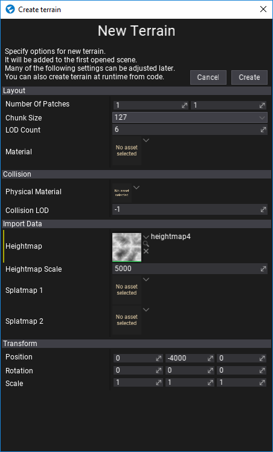
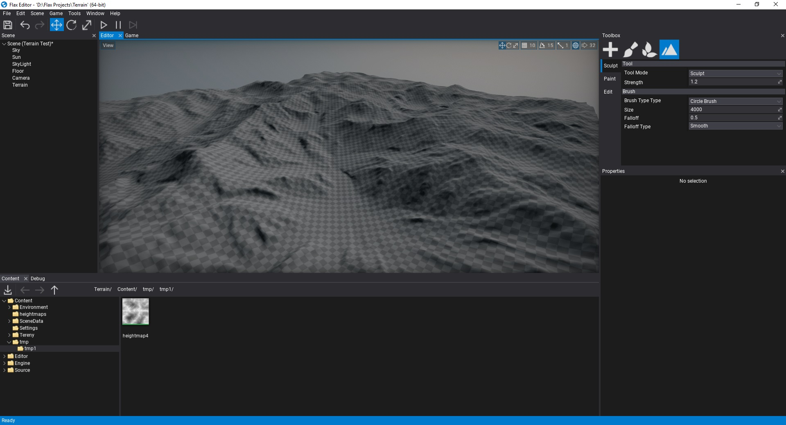

# HOWTO: Import terrain

In this tutorial, you will learn how to generate a terrain from a heightmap texture.

## 1. Import heightmap

Firstly you will need to import a heightmap texture to your project. You can follow [those instructions](../../graphics/textures/index.md) to learn how to do it.

When importing `.RAW` files importer will hint to use *HdrRGBA* format without compression which gives better quality to terrain (also, RAW files needs to have the square size). If you import grayscale heightmap please ensure to use HDR format as well and disable compression to reduce artifacts in the generated terrain. You heightmap after importing won't be used by the engine so don't lock yourself to a certain resolution.

Flax supports **any heightmap size** as a heightmap.

If you don't have any heightmap you can download this image:

## 2. Open scene

Create or open existing level to add new terrain to it. Flax supports many terrains per scene so there is no limit.

## 3. Open terrain creator dialog

Use Main Menu button **Scene -> Create terrain**.

## 4. Adjust options

Use this dialog to adjust the initial terrain properties. Select **chunk size** and amount of **patches** to create. Most of the following properties can be adjusted later. This window supports creating terrain without imported heightmap as shown in [this tutorial](create-terrain.md).

To learn more about terrain patches, chunks and technical details see related documentation [here](../index.md).

## 4. Generate terrain

Press **Create** button and see new terrain added to your scene. Now you can [edit](../editing.md) and [paint](../painting.md) it!

