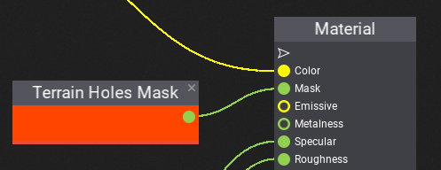
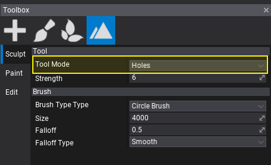

# HOWTO: Create holes in terrain

In this tutorial, you will learn how to create and use a custom terrain material to produce holes in terrain.

## 1. Prepare material material

Use your terrain material or create a new one. You can follow [these instructions](terrain-material.md) to do it.

## 2. Add masking

Create **Terrain Holes Mask** node and connect it with material **Mask** input. It will be used to discard terrain surface pixels that are masked as *invisible*.

## 3. Paint holes mask

Select **Toolbox -> Sculpt -> Holes** mode.

Now, you can paint over the terrain to add holes. If you want to revert you can use **Undo** or press **Control** key to remove holes from the terrain.

> [!Note]
> Materials using **Mask** input are less performant so it's better to use material with holes only for chunks that need it.
