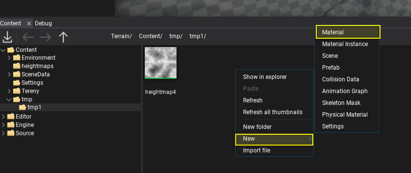
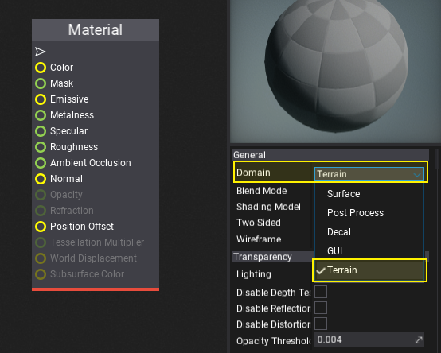
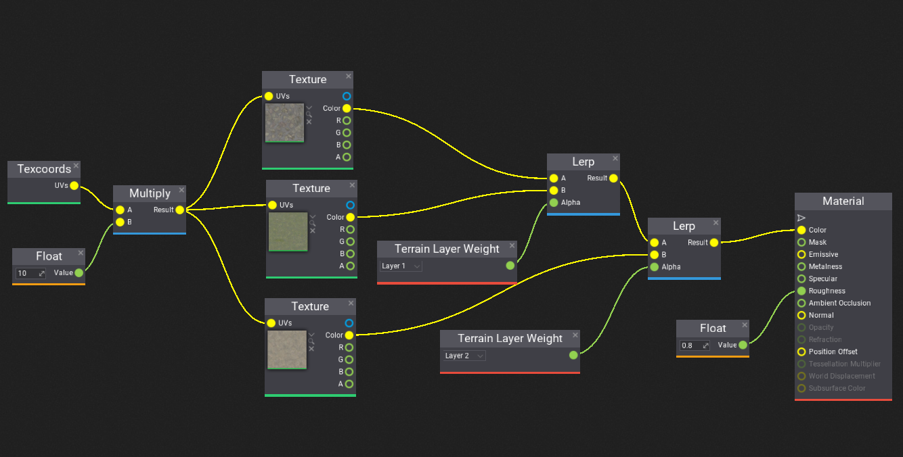
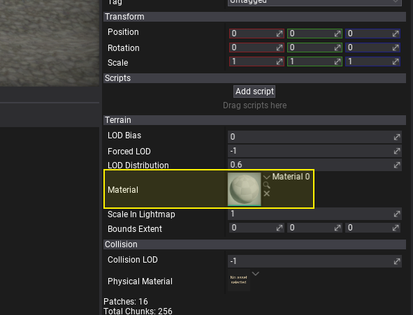
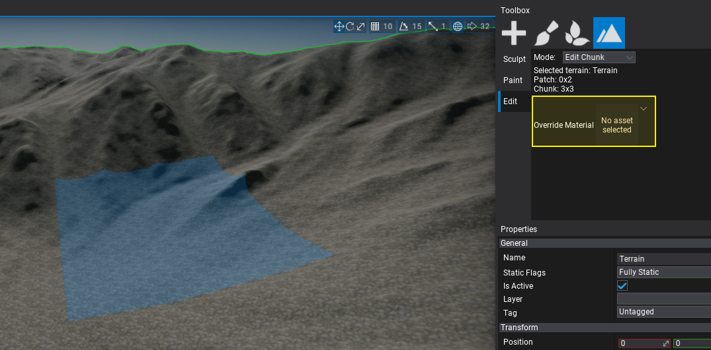
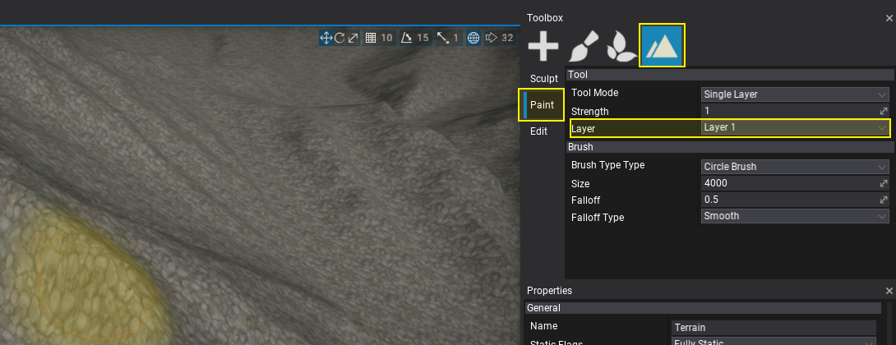
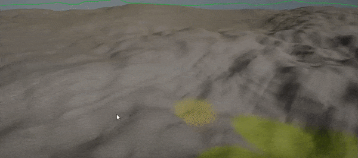

# HOWTO: Create terrain material

In this tutorial, you will learn how to create and use a custom terrain material that blends between various textures.

## 1. Create new material

In *Content* window use **Right-click** and select option **New -> Material**, then specify its name and hit **Enter**.

Then double-click on an asset to open the dedicated editor.

## 2. Set Domain to Terrain

In material properties panel change its **Domain** to **Terrain**.

## 3. Create material

Add various landscape textures and implement simple linear blending using the texture layer weights (as shown in the picture below).

## 4. Assign material to terrain

Save created material and assign it to the terrain **Material** property.

You can also override per chunk material using the toolbox.

## 5. Paint the layers

To use the paint tool select the **Toolbox -> Paint -> Select Layer** and pick the terrain actor to paint over it.

Now using the **left mouse button** you can paint over the terrain with the textures you specified in material. 

