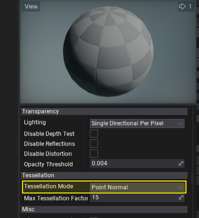
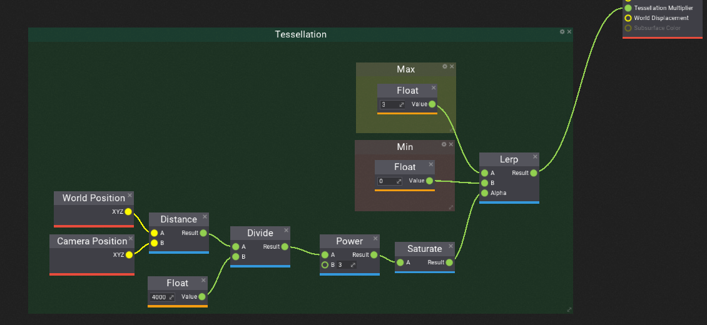
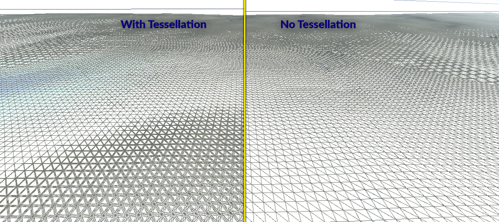

# HOWTO: Add tessallation to terrain

In this tutorial, you will learn how to modify terrain material to use dynamic tessellation and displacement mapping to improve the visual quality and fidelity.

## 1. Create new material

Firstly, you will need to prepare a terrain material. You can reuse your own material or learn how to create a new one using [this tutorial](terrain-material.md).

## 2. Enable tessellation

Open material editor and set the **Tessellation Mode** to **Point Normal** or any other than *None*.

## 3. Define Tessellation Multiplier

Default settings won't add tessellation so you will need to provide **Tessellation Multiplier** parameter. GPU will use this value to perform dynamic triangles hardware tessellation.

The **Tessellation Multiplier** input controls the amount of tessellation along the surface geometry. It allows more detail to be added where needed. As with World Displacement, for this to be enabled, the Tessellation Mode property must be set to something other than None.

In this example, we will perform linear interpolation based on the distance of the vertex from the camera. This will produce nice tessellated triangles near the camera and keep triangles density low far from the view to keep performance stable. Feel free to play around with this setting to give even more quality into your scenes.

## 4. See results

One you save the material and apply it to the terrain you will see the higher quality terrain triangle count near the camera view that is faded smoothly based on distance from the camera.

## 5. Use Displacement

Optionally to add even more detail into your terrain use **World Displacement** input to apply local deformation to tessellated triangles. Displacement works very much like Position Offset, but it uses Tessellation vertices rather than the base vertices of the mesh. In order for this to be enabled, the Tessellation Mode property must be set to something other than None.

