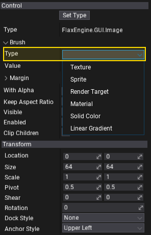
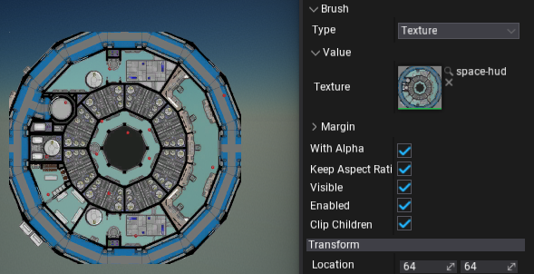
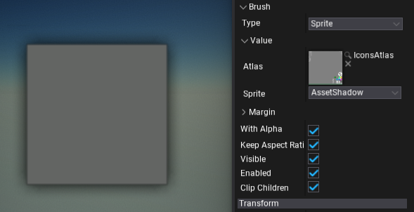
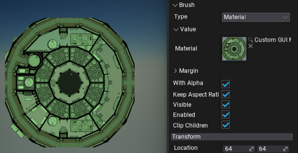
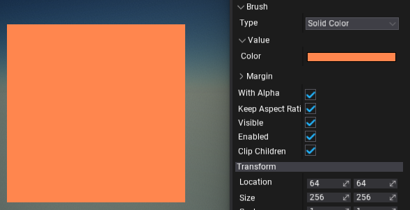

# Brushes

**Brushes** are objects that define the logic used to draw the GUI control area. For instance, [Image](../controls/image.md) control exposes the `Brush` property which can be assigned to describe how to render the image contents.

Brushes can be created and modified via Editor or from C# code (see `IBrush` interface).
To use the brush simply **select the brush type** from the dropdown menu and setup its properties (as shown in a picture below; editing Image control).



# Texture Brush

Brush that draws a texture.



# Sprite Brush

Brush that draws a single sprite from the sprite atlas.



# Render Target Brush

Brush that draws a render target surface (assigned from code).

```cs
var renderTarget = RenderTarget.New();
renderTarget.Init(PixelFormat.R8G8B8A8_UNorm, 640, 480);

image.Brush = new RenderTargetBrush(renderTarget);
```

# Material Brush

Brush that draws the GUI material. To learn how to use it see the related tutorial [here](../tutorials/create-gui-material.md).



# Solid Color Brush

Brush that fill the area with a single, solid color.



# Linear Gradient Brush

Brush that draws a linear, two-color gradient between top and bottom edges of the area.


