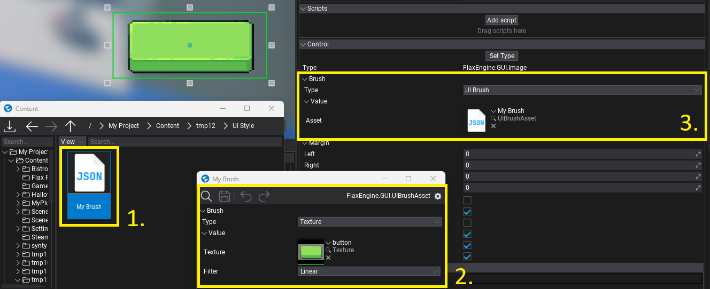

# Brushes

**Brushes** are objects that define the logic used to draw the GUI control area. For instance, [Image](../controls/image.md) control exposes the `Brush` property which can be assigned to describe how to render the image contents.

Brushes can be created and modified via the editor or from C# code (see `IBrush` interface).
To use the brush simply **select the brush type** from the dropdown menu and setup its properties (as shown in a picture below; editing Image control).


# Texture Brush

Brush that draws a texture.


# Sprite Brush

Brush that draws a single sprite from the sprite atlas.


# GPU Texture Brush

Brush that draws a render target surface (assigned from code).

```cs
var texture = new GPUDevice().CreateTexture();
var desc = GPUTextureDescription.New2D(640, 480, PixelFormat.R8G8B8A8_UNorm);

texture.Init(ref desc);

// Reference to an Image control
image.Brush = new GPUTextureBrush(texture);
```

# Material Brush

Brush that draws the GUI material. To learn how to use it see the related tutorial [here](../tutorials/create-gui-material.md).


# Solid Color Brush

Brush that fill the area with a single, solid color.


# Linear Gradient Brush

Brush that draws a linear, two-color gradient between top and bottom edges of the area.


# 9-Slicing Brush

9-slicing is a technique used in 2D graphics that splits a single image into 9 areas which are scaled individually in order to prevent stretching when the image is displayed at different sizes and with different aspect ratios. In most cases, it's useful to prevent image borders from stretching for panels and buttons.


9-slicing is used by *Texture 9-Slicing* brush and *Sprite 9-Slicing* brush. To set up those brushes adjust the **Border** property that defines the image borders in texture space (0-1 range). **Border Size** defines the pixel size of the borders. You can use debug checkbox **Show Borders** to display a 9-slicing borders rectangle. It helps when adjusting the settings.

# Video Brush

Video Brush displays image from Video Player inside UI element use. Video Brush needs a reference to the Video Player to access GPU Texture - assign it via `Player` property. Learn more [here](../../graphics/video/index.md).


# UI Brush

UI Brush uses the brush defined in UI Brush Asset. This allows to define UI styling inside json asset. To use it, **create a new Json Asset**, then select `UIBrushAsset` and confirm. Open that new asset and edit Brush property. Then you can assign that asset to `UI Brush`, which will display it.


