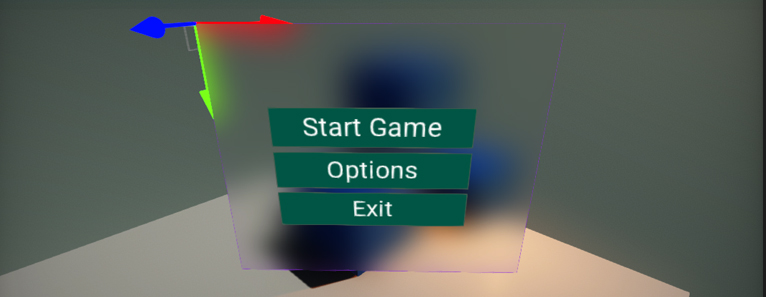

# UI Canvas

**UI Canvas** is an actor type that renders UI. It's root of the UI structure and performs GUI drawing with input events handling. Canvas can be placed in 3D level (as world-space or camera-space object) or rendered directly on a screen (as screen-space mode).

> [!Note]
> After creating UI Canvas in editor it is rotated by default. That is because the GUI coordinates system uses the upper-left corner of the container as a origin for transformations.

## Properties

| Property | Description |
|--------|--------|
| **Render Mode** | Canvas rendering mode. Possible options: <table><tbody><tr><th>Option</th><th>Description</th></tr><tr><td>**Screen Space**</td><td>The screen space rendering mode that places UI elements on the screen rendered on top of the scene. If the screen is resized or changes resolution, the Canvas will automatically change size to match this.</td></tr><tr><td>**Camera Space**</td><td>The camera space rendering mode that places Canvas in a given distance in front of a specified Camera. The UI elements are rendered by this camera, which means that the Camera settings affect the appearance of the UI. If the Camera is set to Perspective, the UI elements will be rendered with perspective, and the amount of perspective distortion can be controlled by the Camera Field of View. If the screen is resized, changes resolution, or the camera frustum changes, the Canvas will automatically change size to match as well.</td></tr><tr><td>**World Space**</td><td>The world space rendering mode that places Canvas as any other object in the scene. The size of the Canvas can be set manually using its Transform, and UI elements will render in front of or behind other objects in the scene based on 3D placement. This is useful for UIs that are meant to be a part of the world. This is also known as a "diegetic interface".</td></tr></tbody></table>|
| **Render Location** | Canvas rendering location within the rendering pipeline. Change this if you want GUI to affect the lighting or post processing effects like bloom. *Used only by 3D canvas (World Space or Camera Space).* Possible options: <table><tbody><tr><th>Option</th><th>Description</th></tr><tr><td>**Default**</td><td>The default location after the in-build PostFx pass (bloom, color grading, etc.) but before anti-aliasing effect.</td></tr><tr><td>**Before Post Processing Pass**</td><td>The 'before' in-build PostFx pass (bloom, color grading, etc.). After Forward Pass (transparency) and fog effects.</td></tr><tr><td>**Before Forward Pass**</td><td>The 'before' Forward pass (transparency) and fog effects. After the Light pass and Reflections pass.</td></tr><tr><td>**Before Reflections Pass**</td><td>The 'before' Reflections pass. After the Light pass. Can be used to affect Screen Space Reflections by the GUI.</td></tr><tr><td>**After Anti-Aliasing Pass**</td><td>The 'after' AA filter pass. Rendering is done to the output backbuffer.</td></tr></tbody></table>|
| **Order** | The canvas rendering and input events gather order. Created GUI canvas objects are sorted before rendering (from the lowest order to the highest order). Canvas with the highest order can handle input event first. |
| **Receives Events** | If checked, canvas can receive the input events. |
| **Size** | Canvas size. *Used only by World Space canvas.*|
| **Ignore Depth** | If checked, scene depth will be ignored when rendering the GUI (scene objects won't cover the interface). *Used only by 3D canvas (World Space or Camera Space).* |
| **Render Camera** | Camera used to place the GUI. *Used only by Camera Space canvas.* |
| **Distance** | Distance from the RenderCamera to place the plane with GUI. If the screen is resized, changes resolution, or the camera frustum changes, the Canvas will automatically change size to match as well. Value in world units. |
