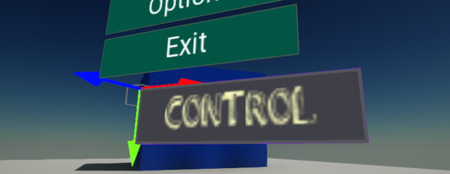
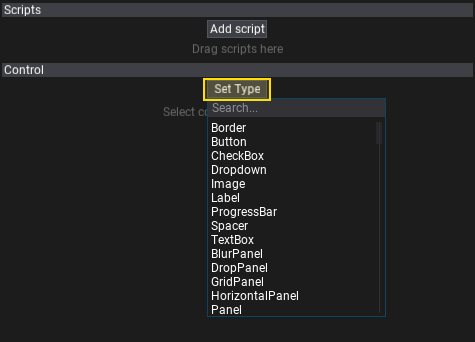
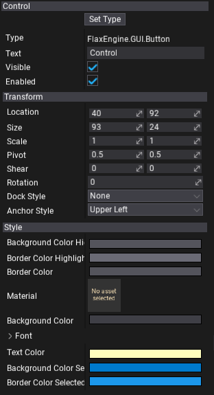

# UI Control



**UI Control** is an actor type that contains a single GUI control. It handles the control linkage to the parent container control or canvas and provides solid data serialization along with the C# API.

## Setting up a control type

In the editor, to set the control type select the UI Control and click on the **Set Type** button. You can pick one type from the list or type to search by class name instead. It supports also custom control types created from code. To learn more about it see the related tutorial [here](../tutorials/create-custom-control.md).



You can also modify the control from C# code, as shown below:

```cs
public class MyScript : Script
{
	public UIControl MyControl;

	public override void OnStart()
	{
		MyControl.Control = new Button
		{
			Text = "Hello there!",
			Width = 130,
		};
	}
}
```

Finally, you can also change the type of the already created control and undo the changes if required.

## Editing a control

You can modify all exposed properties of the created control using the *Properties Window*. Select the control actor and edit the control. The topmost property with the label **Type** displays the full name of the current control type.

To learn more about using the control **Transform** see the related documentation [here](transform.md).




