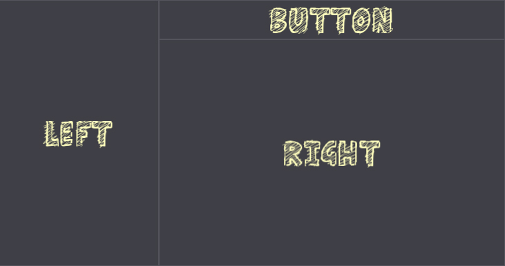

# Control Transform

Every GUI control contains a set of properties related to transforming the control within the parent container. Every control location can be assigned and fixed or depend on the parent container control dimensions. Use the properties group **Transform** when editing selected **UI Control** in the editor to adjust its appearance. All these options can be also modified at runtime from C# code.

## Location

The location of the upper-left corner of the control relative to he upper-left corner of its container.

## Size

The size of the control bounds.

## Scale

The control scale parameter.

## Pivot

The control rotation pivot location in normalized control size. Point (0,0) is upper left corner, (0.5,0.5) is center, (1,1) is bottom left corner.

## Shear

The shear transform angles (x, y). Defined in degrees.

## Rotation

The control rotation angle (in degrees).

## Dock Style

The docking style of the control. Defines how control will be docked into the parent container. Use None to disable it. Docked controls have disabled scrolling.

## Anchor Style

The anchor style of the control. Defines how control location and size will be constrained when parent container is being resized. Use it to maintain the relationship between control and the edge of the parent container when a parent is changing its size.

