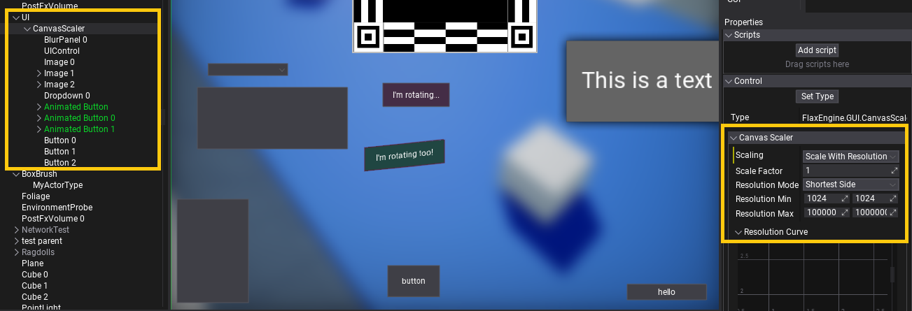

# Canvas Scaler

The **CanvasScaler** control is a scaling component for user interface to target multiple different game resolutions (eg. mobile screens). It can be used to constrain UI to min/max resolutions or scale depending on the display DPI or resolution. Use **Scaling** property to define the logic of the scaler and **ScaleFactor** property to control UI scale manually.

| Mode | Description |
|--------|--------|
| **Constant Pixel Size** | Applies constant scale to the whole UI in pixels. |
| **Constant Physical Size** | Applies constant scale to the whole UI in physical units (depends on the screen DPI). Ensures the UI will have specific real-world size no matter the screen resolution. |
| **Scale With Resolution** | Applies min/max scaling to the UI depending on the screen resolution. Ensures the UI size won't go below min or above max resolution to maintain it's readability. |
| **Scale With Dpi** | Applies scaling curve to the UI depending on the screen DPI. |

## Example setup

Below is the example setup for the canvas scaler which ensure the UI will be scaled with resolution (shortest side of the screen edge) with *Resolution Curve*, and UI size will be limited to the min size of `1024x1024`.

> [!Tip]
> You can *right-click* on curve editor and select option **Edit all keyframes** to modify curve data if the Editor UI doesn't handle proper editing.

The best way to use Canvas Scaler is to add it directly as a child of the *Canvas** and setup UI inside it.
