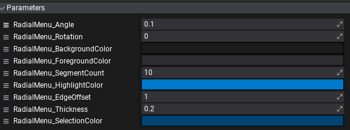

# Radial Menu


Radial menus are useful when making a quick select menu and normal menu types just do not fit. The radial menu has two modes:
* Layout Controller
* Material Controller

> [!Warning]
> Radial Menu supports only `Image` controls as children now.

### Layout Controller

Any child control added to the radial menu will be automatically layout around its center.

### Material Controller

Material assigned to the Radial Menu control can be used to draw the background to display selected and highlighted controls. You can clone the default engine material used on the Radial Menu to create a custom UI style. Simply ensure to set and use the following parameters controlled by the control logic:



### Sample script

```cs
public class RadialMenuUsageExample : Script
{
    public ControlReference<RadialMenu> ActorRadialMenu;
    private RadialMenu _radialMenu;

    public override void OnStart()
    {
        _radialMenu = ActorRadialMenu.Control;
        _radialMenu.Selected += OnOptionSelected;
    }

    public override void OnDestroy()
    {
        _radialMenu.Selected -= OnOptionSelected;
    }

    private void OnOptionSelected(int selectedOption)
    {
        if (!Enabled)
            return;
        if (_radialMenu.CenterAsButton)
        {
            if (selectedOption == 0)
            {
                Debug.Log("[Radial Menu] Center has been clicked");
            }
            else
            {
                if (selectedOption == -1)
                {
                    Debug.Log("[Radial Menu] Selection has been lost");
                }
                else
                {
                    Debug.Log($"[Radial Menu] Option {selectedOption} has been selected");
                }
            }
        }
        else
        {
            if (selectedOption == -1)
            {
                Debug.Log("[Radial Menu] Selection has been lost");
            }
            else
            {
                Debug.Log($"[Radial Menu] Option {selectedOption} has been selected");
            }
        }
    }
}
```
