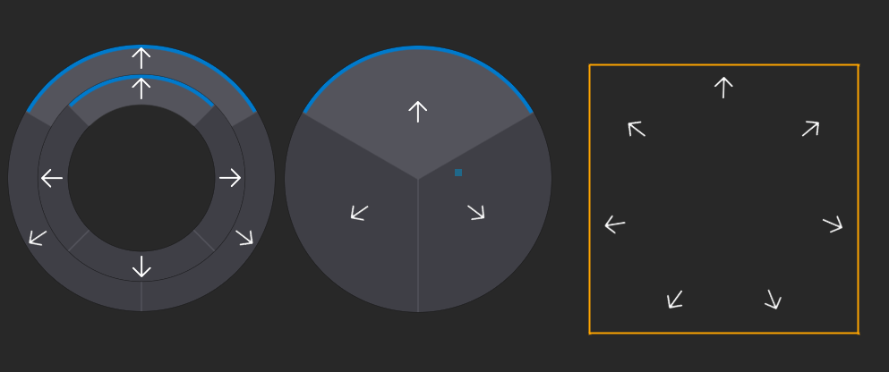

# Radial Menu



Radial menus are useful when making a quick select menu, where normal menu types just do not fit.</br>

| Parameter                         | Description                                                                                                                                                            |
|---------------------------------- |------------------------------------------------------------------------------------------------------------------------------------------------------------------------|
|Thickness                          | How thick the randial menu is                                                                                                                                          |
|Edge Offset                        | Distance to the edge of the UI unform bounds size                                                                                                                      |
|Center As Button                   | Center is becoming a button                                                                                                                                            |
|Allow Change Selection When Inside | By default is set to **false** changing it to **true** will allow mouse to swap selection when inside the region considered as a button if the **Center As Button** is set to **true** <br> this regon is defined with <br>Center = ((1.0 - EdgeOffset) - Thickness) * uniformSize * 0.5,<br> keeping value false is useful when creating a stacked menus |

> [!NOTE]
> The radial menu has two modes

| Mode                                      | Active if            |
|-------------------------------------------|----------------------|
| Layout Controller                         | Material is not set  |
| Layout Controller and Material Controller,| Material is set      |

> [!NOTE]
> Default background brush is not working, the draw function is overridden by Radial Menu.</br>
> background brush is coming from the base class `Control` and is not supported by Radial Menu, yes this is intentional.


> [!WARNING]
> Adding more than 127 elements as a child where child is parent of radial menu will cause int8 overflow.</br>
> This might have caused unintended behavior

### Layout Controller

Any child control added to the radial menu will be automatically layout around its center.

> [!NOTE]
> It's recommended to add children by a script in this mode,
> index inside RadialMenu.Children array dictates the order of the UI elements,

### Material Controller and Layout Controller
Child control added to the radial menu will be automatically layout around its center.

> [!IMPORTANT]
> Radial Menu supports only `Image` controls as children. do to mouse ray being blocked by mouse capturing UI events elements,</br> This is intentional and will not be changed</br>
> Radial Menu creates instance of the material with can't be accessed yet (this will be changed).

### Sample script

> [!IMPORTANT]
> Provided Sample script doesn't apply to when mode (Material Controller and Layout Controller) is not active

```cs
public class RadialMenuUsageExample : Script
{
    public Actor ActorRadialMenu;
    private RadialMenu _radialMenu;

    public override void OnStart()
    {
        _radialMenu = ActorRadialMenu.As<UIControl>().Control as RadialMenu;
        _radialMenu.Selected += OnOptionSelected;
    }

    public override void OnDestroy()
    {
        _radialMenu.Selected -= OnOptionSelected;
    }

    private void OnOptionSelected(int selectedOption)
    {
        if (!Enabled)
            return;
        if (_radialMenu.CenterAsButton)
        {
            if (selectedOption == 0)
            {
                Debug.Log("[Radial Menu] Center has been clicked");
            }
            else
            {
                if (selectedOption == -1)
                {
                    Debug.Log("[Radial Menu] Selection has been lost");
                }
                else
                {
                    Debug.Log($"[Radial Menu] Option {selectedOption} has been selected");
                }
            }
        }
        else
        {
            if (selectedOption == -1)
            {
                Debug.Log("[Radial Menu] Selection has been lost");
            }
            else
            {
                Debug.Log($"[Radial Menu] Option {selectedOption} has been selected");
            }
        }
    }
}
```


### Abaut Material's
Material assigned to the Radial Menu control can be used to draw the background to display selected and highlighted controls.</br>

#### Default Material
> [!IMPORTANT]
> Radial menu Default material, expect min of 2 children.</br>

Default Radial Menu is fully genereted out of math it is not using any textures
1. Gradient nodes used
    * Cone
    * Cycle
    * Linear
    * Radial
    * Ring
1. Utility nodes used
    * Falloff and offset
    * Rotate UV (exists inside the custom code node)

#### Custom Material
To create a custom UI style.</br>
You can clone the default engine material can be found in **Flax/Content/Engine/DefaultRadialMenu.flax** used in Radial Menu by default,</br>
or make youre own</br>
1. **Material parameters requaierd**</br>
    Ensure material is using following parameters, parameters are controlled by the radial menu
    > [!IMPORTANT]
    > All paramiters are pefixed with **"RadialMenu_"**

    | Parameter     | Description                                                        | type    | Range           |
    |---------------|--------------------------------------------------------------------|---------|-----------------|
    |Angle          | angle between cells and how big the selector is                    | float   | 0 to pi         |
    |Rotation       | how much to rotate the selector                                    | float   | 0 to pi         |
    |SegmentCount   | how many segment the Radial Menu contents                          | int     | 0 to int8.max   |
    |Thickness      | how thick the randial menu is distance form the center to edge     | float   | 0 to 1          |
    |EdgeOffset     | distance to the edge of the UI unform bounds size                  | float   | 0 to 1          |
    |SelectionColor | color of the selector [it is swaped with highlighted on selection] | Color   | -               |
    |HighlightColor | primary use is as secondary color for selector highlighted         | Color   | -               |
    |BackgroundColor| primary use is as the not selected color                           | Color   | -               |
    |ForegroundColor| primary use is as segment separator color                          | Color   | -               |
</br>
If you Ensured material is using correct parameters
you can go the same route as Default Material if u are Shader/Material Graph magician or use textures with masks

#### Adding Custom Material parameters
*coming soon*
#### Custom Material Tutorial
*coming soon*

<!---
THE TODO dont remove this comment
we are not leaving users in the dark

1. Creating a selector mask
*coming soon*
2. using selector mask to mask a Texture
*coming soon*
3. Rotating Selector using given parameters
*coming soon*
4. Creating a Ring Mask for unselected Area
*coming soon*
5. using Ring mask to mask a Texture for unselected Area
*coming soon*
6. Final step's
*coming soon*
we are done have fun exploring possibilities
-->