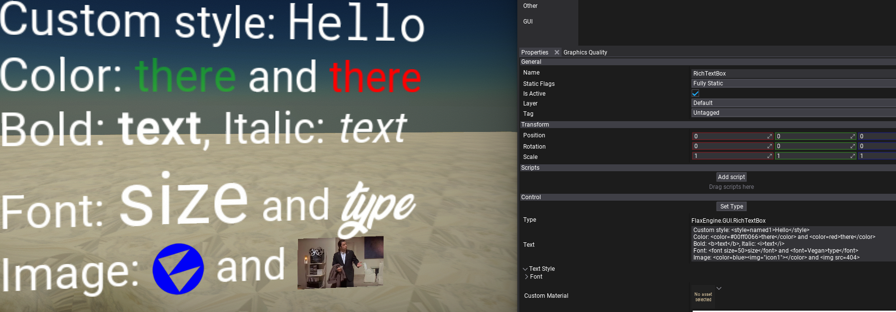

# RichTextBox

The **RichTextBox** control allows display formatted text using advanced styling options.

## Tags

Rich text box tags can be used to alter the appearance and layout of the text. These tags work like `HTML` or `XML` tags, but they have less strict syntax that is more optimzied for games.

A single tag looks like `<tag>` with special `<` and `>` characters and name inside it. There are some tags which operate in a scope, which you can end with `</tag>` (note `/` character). Those scopes can be nested, for example bold text scope can have italics inside it.

Many tags accept attributes with syntax `<tag=value>` or `<tag attribute=value>`. These argument values are either names or numeric values. Numbers are either regular decimal numbers, percentages like `80%` or hexadecimal values like `#FA`. Names can be specified either with or without double quotes (especially if the name contains spaces or special characters inside it).

## HTML Tags List

List with all supported tags (games and/or plugins can provide custom tags as well).

| Tag | Example | Description |
|--------|--------|--------|
| `<b>` | `Here is <b>bold text</b>.` | Changes the font style by making text bold. |
| `<i>` | `Here is <i>italic text</i>.` | Changes the font style by making text italic. |
| ` ` | `Here is  a newline.` | Inserts a newline. |
| `<color=X>` | `Here is <color=red>red</color> and <color=#0000FF>blue</color> text.` | Controls the color of the text and images. `X` - named color or hexadecimal value. |
| `<alpha=X>` | `Here is <alpha=50%>transparent</alpha> text.` | Controls the opacity. `X` - percentage or hexadecimal value. |
| `` | `Here is an image .` | Inlined image (texture or sprite) from `Images` property of `RichTextBox` or found globally by filename in the Content. `X` - image name. `Y`/`Z` - image width/height override with sepcific value or percentage, `W` - image scale or percentage. |
| `<size=X>` | `Here is <size=50>larger</size> text.` | Controls the text size. `X` - font size (value or percentage). |
| `<font=X size=Y>` | `Here is larger text with <font=font1>style.` | Controls the text font. `X` - font asset name, `Y` - font size (value or percentage). |
| `.` | Controls the text style. `X` - style name from `Styles` property of `RichTextBox`. |
| `<align=left/center/right>` | `Here is centered text <align=center>text</align>.` | Controls the horizontal alignment of the contents. |
| `<valign=top/bottom/middle/baseline>` | `Here is centered image <valign=middle></valign>.` | Controls the vertical alignment of the contents. |
| `
` | `Here is centered text 
text
.` | Centers the contents horizontally. |
