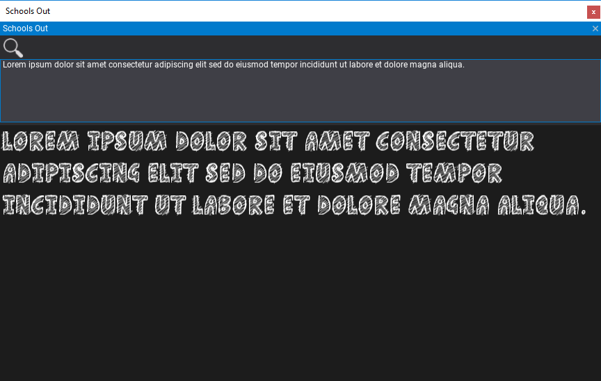
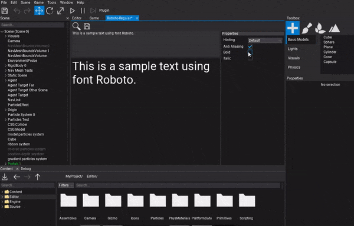

# Fonts

**Font Assets** are binary resources that contain information of font characters (and/or prerendered characters texture).
Flax performs the required importing, loading and rasterization of the font glyphs. Fonts are used by the 3D [Text Render](../text-render/index.md) actor, as well as the [UI](../index.md) system.

Flax uses the **FreeType** library for font character rasterization and offline rendering.

## Importing fonts

You can import font files to use as font assets in your project. Flax supports importing the following file types as fonts:

* `.ttf`
* `.otf`

The easiest way to import one or more fonts is to drag them from the file explorer to the *Content Window*.
Alternatively, you can use the **Import** button in the *Content Window* toolbar and then select the files to import.

## Font Window

**Double-click** on an imported font asset in the *Content Window* to open the dedicated font asset tool window.
You can use it to type text and preview the font.

## Font Properties

The font window can be used to preview and edit the font rasterization options:

| Property | Description |
|--------|--------|
| **Hinting** | The font hinting used when rendering characters. Possible options include: <table><tbody><tr><th>Option</th><th>Description</th></tr><tr><td>**Default**</td><td>Use the default hinting specified in the font.</td></tr><tr><td>**Auto**</td><td>Force the use of an automatic hinting algorithm (over the fonts native hinter).</td></tr><tr><td>**Auto Light**</td><td>Force the use of an automatic light hinting algorithm, optimized for non-monochrome displays.</td></tr><tr><td>**Monochrome**</td><td>Force the use of an automatic hinting algorithm optimized for monochrome displays.</td></tr><tr><td>**None**</td><td>Do not use hinting. This generally generates 'blurrier' bitmap glyphs when the glyphs are rendered in any of the anti-aliased modes.</td></tr></tbody></table> |
| **Anti Aliasing** | Enables using anti-aliasing for font characters. Otherwise the font will use monochrome data. |
| **Bold** | Enables an artificial embolden effect. |
| **Italic** | Enables a slant effect, emulating italic style. |

