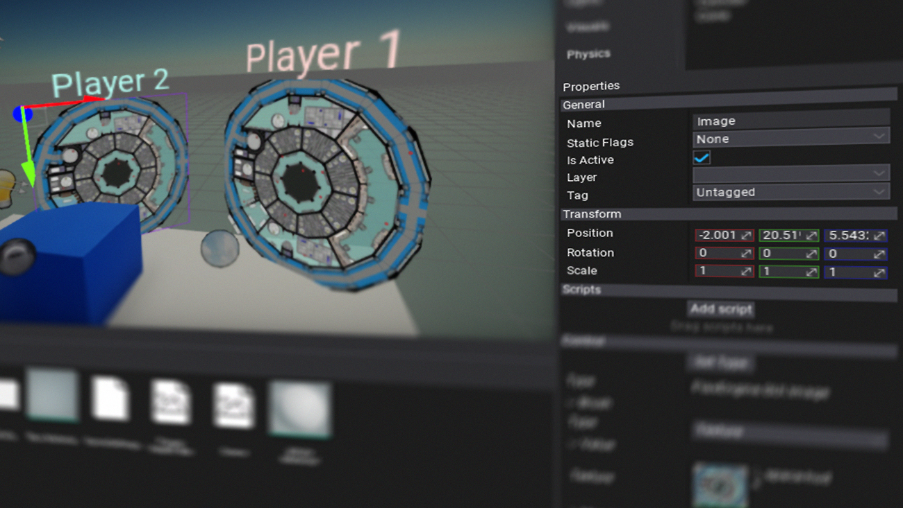

# UI

The **UI** is one of the most important components of the games. Flax Games UI system allows to create user interfaces fast and intuitively right in the Editor or from code. Follow this documentation section to learn how to work with UI controls and use them in your games.

## In this section

* [UI Canvas](canvas/index.md)
* [UI Control](control/index.md)
 * [Transform](control/transform.md)
* [Brushes](brushes/index.md)
* [Controls](controls/index.md)
 * [Button](controls/button.md)
 * [CheckBox](controls/checkbox.md)
 * [Image](controls/image.md)
 * [Label](controls/label.md)
 * [Dropdown](controls/dropdown.md)
 * [TextBox](controls/textbox.md)
 * [Border](controls/border.md)
 * [Panel](controls/panel.md)
 * [Drop Panel](controls/drop-panel.md)
 * [Blur Panel](controls/blur-panel.md)
 * [Progress Bar](controls/progress-bar.md)
 * [Spacer](controls/spacer.md)
 * [Grid Panel](controls/grid-panel.md)
 * [Uniform Grid Panel](controls/uniform-grid-panel.md)
 * [Horizontal Panel](controls/horizontal-panel.md)
 * [Vertical Panel](controls/vertical-panel.md)
 * [Tiles Panel](controls/tiles-panel.md)
* [Fonts](fonts/index.md)
* [Text Render](text-render/index.md)
* [Tutorials](tutorials/index.md)

## Tutorials

* [How to create UI](tutorials/create-ui.md)
* [How to create UI from code](tutorials/create-ui-from-code.md)
* [How to create custom font material](tutorials/create-font-material.md)
* [How to create custom GUI material](tutorials/create-gui-material.md)
* [How to blur UI panel background](tutorials/blur-background.md)
* [How to create Main Menu](tutorials/create-main-menu.md)
* [How to create custom control](tutorials/create-custom-control.md)

