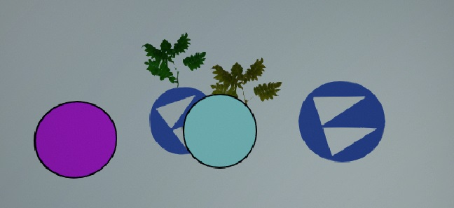
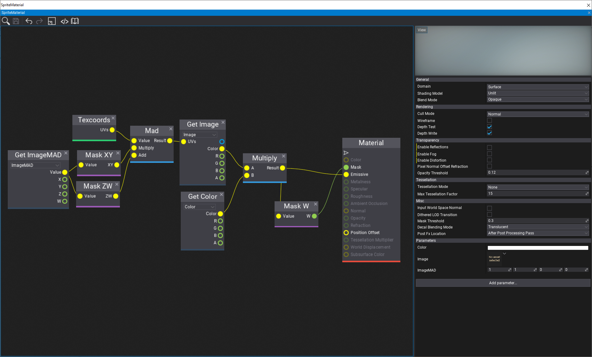
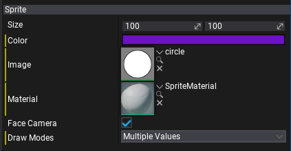

# Sprite Render

The **Sprite Render** is an actor type that renders a sprite image. It can be sued to display an image on the screen with custom color tint.

The default material for sprites created in Editor is Unlit. You can create custom materials and use them in sprites. Ensure to include parameters `Color` and `Image` to support passing sprite actor properties to the shader. For showing sprites from sprite atlas ensure to add Vector4 param `ImageMAD` for UVs transformation (multiply-add texcoords for sampled image).

## Properties

| Property | Description |
|--------|--------|
| **Size** | Size of the sprite. |
| **Color** | Color of the sprite. Passed to the sprite material in parameter named `Color`. |
| **Image** | Texture to use as sprite image. |
| **Sprite** | The sprite sprite to draw. Used only if Image is unset. |
| **Material** | Material used for the sprite rendering. It should contain texture parameter named `Image` and color parameter named `Color`. For showing sprites from sprite atlas ensure to add Vector4 param ImageMAD for UVs transformation. |
| **Face Camera** | If checked, the sprite will automatically face the view camera, otherwise it will be oriented as an actor. |
| **DrawModes** | The draw passes to use for rendering this object. Uncheck `Depth` to disable sprite casting shadows. |
