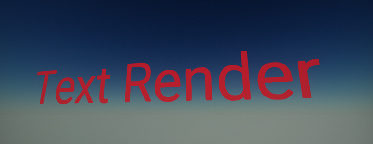
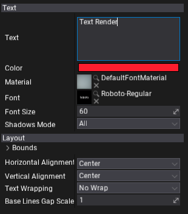

# Text Render

The **Text Render** is an actor type that renders a 3D text. The text can use a custom font and material to perform rendering. Shadows casting and receiving is also supported.

In the editor, if you select the text render actor it displays the debug bounds which are:
* `Orange` - axis-aligned bounding box of the text glyphs characters positions (vertices AABB, see **Local Box** property)
* `Blue Violet` - layout rectangle of the text that is used to wrap, align and position text characters (see **Bounds** property).

## Properties

| Property | Description |
|--------|--------|
| **Text** | Text to render. |
| **Color** | Color of the text. |
| **Material** | Material to use for rendering. It **must** contain a texture parameter named 'Font' used to sample the font texture itself. |
| **Font** | Font to use for rendering. |
| **Font Size** | Size of the font characters. |
| **Shadows Mode** | Shadows casting mode by this visual element. |
|||
| **Bounds** | Layout area rectangle in local space of the object (on XY plane). |
| **Horizontal Alignment** | Text horizontal alignment inside the layout rectangle. |
| **Vertical Alignment** | Text vertical alignment inside the layout rectangle. |
| **Text Wrapping** | Text wrapping mode inside the layout bounds. |
| **Base Lines Gap Scale** | Scale parameter for the lines gap. Default value is 1. |
