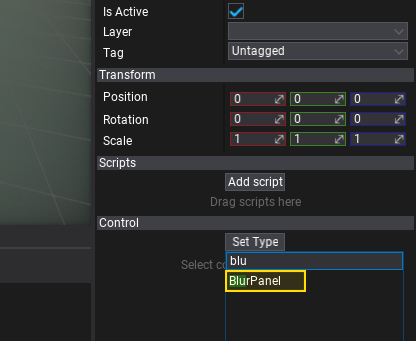
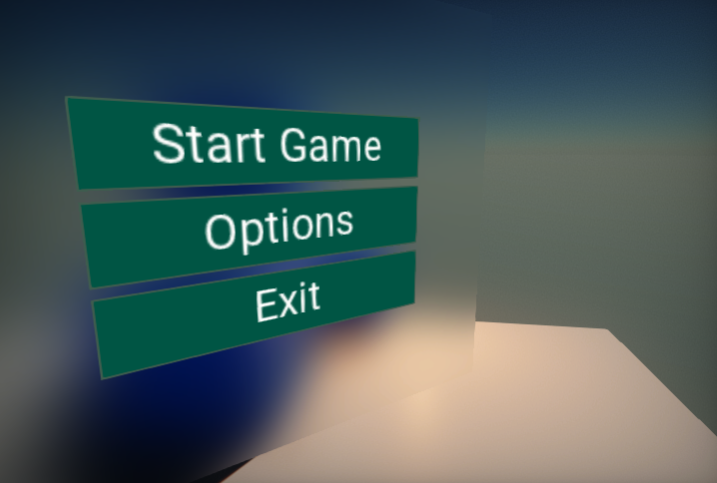

# HOWTO: Blur UI panel background

In this tutorial, you will learn how to create a blur panel and use it to distort the background of the UI panel. To learn more about properties of that control see the related documentation [here](../controls/blur-panel.md).

## 1. Create UI

The first step is to prepare the UI. You can follow [this tutorial](create-main-menu.md) to learn how to do it.

## 2. Create `UIControl`

Follow the same steps as in the previous step, except now create [UI Control](../control/index.md) actor that represents a single GUI control. Add it as a child to the *UI Canvas* (as shown in a picture below). It's important to move the created control to be *before* the other controls in the hierarchy (eg. as the first child of the canvas).

## 3. Set control type to `Blur Panel`

Created GUI will use a `Blur Panel` control. To do so, select the spawned **UI Control** and use **Set Type** button to assign its type to **Blur Panel**. Pick the item from the list or type to search it.

## 4. Adjust panel

Now, set the **Blur Strength** to **8** and adjust the **bounds** of the control to cover the whole background of the interface (you can use *Dock Style* set to *Fill*).

## 5. See the results

The blur panel captures the scene and the UI that is located beneath the control and applied the Gaussian Blur. You can use the *Background Color* property to create a colored blur.

The picture below shows the result effect.

