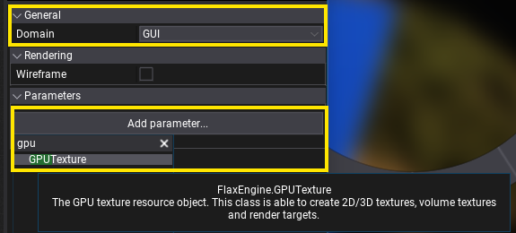
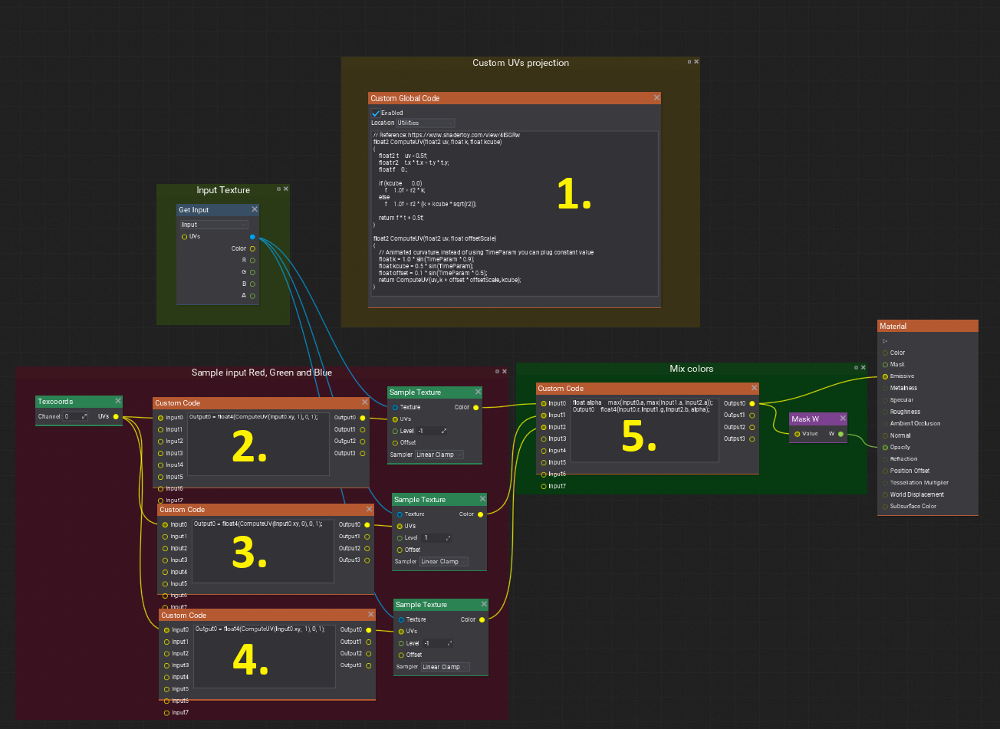
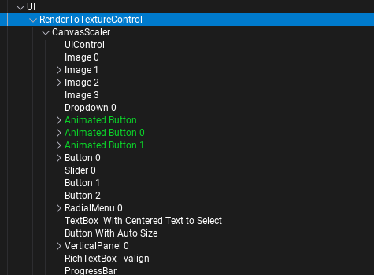
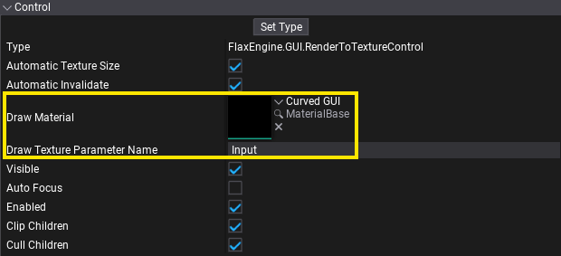
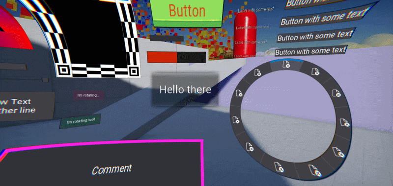

# HOWTO: Create a curved and distorted UI

In this tutorial, you will learn how to create a custom post-process material for UI that makes it look curved and distorted with chromatic aberration. Such effect can be used on the player HUD (Heads-Up Display) to complete game stylization or implement specific art direction.

## 1. Create material



Create a new material and set its **Domain** to **GUI**. Then add a new `GPUTexture` parameter and set it's name to **Input**. This parameter will be assigned by the engine to texture with rendered underlying UI structure. This material will be able to display it in a custom way.

## 2. Build a shader



Now, you can sample that **Input** texture to display its contents by plugging color into **Emissive** and alpha into **Opacity** of the material main node.

In this example, you can see an advanced shader that samples a texture 3 times with a custom distortion effect. Code contents of nodes:

1) Custom Global Code set to `Utilities`:

```hlsl
// Reference: https://www.shadertoy.com/view/4lSGRw
float2 ComputeUV(float2 uv, float k, float kcube)
{
    float2 t = uv - 0.5f;
    float r2 = t.x * t.x + t.y * t.y;
    float f = 0.;

    if (kcube == 0.0)
        f = 1.0f + r2 * k;
    else
        f = 1.0f + r2 * (k + kcube * sqrt(r2));

    return f * t + 0.5f;   
}

float2 ComputeUV(float2 uv, float offsetScale)
{
    // Animated curvature, instead of using TimeParam you can plug constant value  
    float k = 1.0 * sin(TimeParam * 0.9);
    float kcube = 0.5 * sin(TimeParam);
    float offset = 0.1 * sin(TimeParam * 0.5);
    return ComputeUV(uv, k + offset * offsetScale, kcube);
}
```

2) Custom Code that takes `Texcoords` as input and outputs UVs to `Sample Texture` with `Linear Clamp` sampler:

```hlsl
Output0 = float4(ComputeUV(Input0.xy, 1), 0, 1);
```

3) Custom Code that takes `Texcoords` as input and outputs UVs to `Sample Texture` with `Linear Clamp` sampler:

```hlsl
Output0 = float4(ComputeUV(Input0.xy, 0), 0, 1);
```

4) Custom Code that takes `Texcoords` as input and outputs UVs to `Sample Texture` with `Linear Clamp` sampler:

```hlsl
Output0 = float4(ComputeUV(Input0.xy, -1), 0, 1);
```

5) Custom Code that takes all 3 texture samples and mixes them into the final color:

```hlsl
float alpha = max(Input0.a, max(Input1.a, Input2.a));
Output0 = float4(Input0.r, Input1.g, Input2.b, alpha);
```

## 3. Add `RenderToTextureControl`



Setup you game UI hierarchy to contain `RenderToTextureControl` control which shoudl wrap the game UI.



Then, assign a custom material to the **Draw Material** property. It will be used to blit the rendered UI texture with a custom material.

## 3. Test it out!

Finally, adjust the exposed properties of the control and see the final results.


