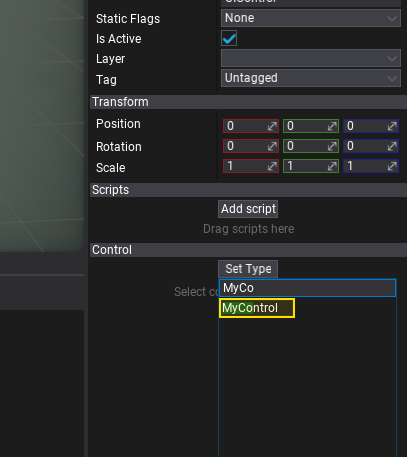
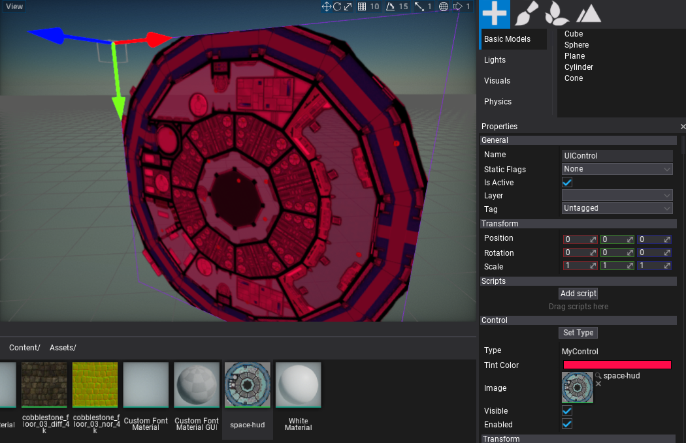

# HOWTO: Create a custom control

In this tutorial, you will learn how to create  a customized User Interface control for your game. Flax Engine uses UI scripted on a C# side so you can add your own controls and container controls as needed.

## 1. Create `MyControl` script

Add a new script named `MyControl` that will implement the control logic. The C# class needs to inherit from the [Control](https://docs.flaxengine.com/api/FlaxEngine.GUI.Control.html) type. To learn more about creating and using scripts see [this tutorial](../../scripting/new-script.md).

## 2. Edit the script

Open the script file and write the following code:

```cs
using FlaxEngine;
using FlaxEngine.GUI;

public class MyControl : Control
{
	[EditorOrder(0), Tooltip("Rendered texture tin color. Use red as default.")]
	public Color TintColor { get; set; } = Color.Red;

	[EditorOrder(1), Tooltip("The texture to draw.")]
	public Texture Image { get; set; }

	/// <inheritdoc />
	public override void Draw()
	{
		base.Draw();

		//TODO: False arguments! Fix next commit.
		Render2D.DrawTexture(Image, new Rectangle(Vector2.Zero, Size), TintColor, true);
	}
}
```

As you can see it exposes a texture property and the tint color used for rendering. Use [Render2D](https://docs.flaxengine.com/api/FlaxEngine.Render2D.html) to perform custom rendering tasks. Also you can override all control events to provide any other custom logic for your UI. Feel free to experiment.

## 3. Spawning the `UI Control`

Now spawn a new *UI Control* to the scene and set its type to **MyControl** as shwon in a picture below.
To learn more how to do so see the related [tutorial here](create-ui.md).



## 4. Test it out!

Finally, adjust the exposed properties of the control and see the final results.



