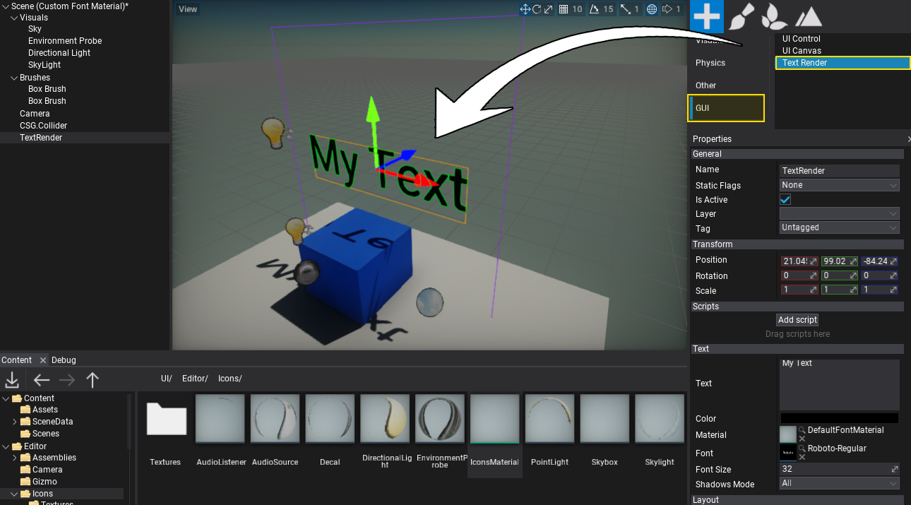
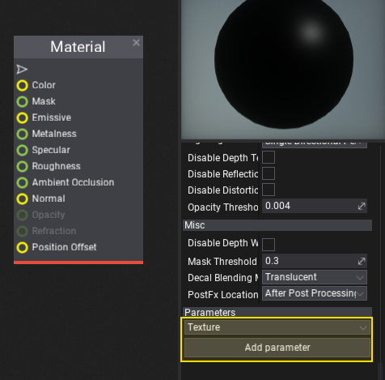
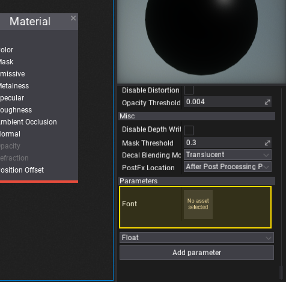
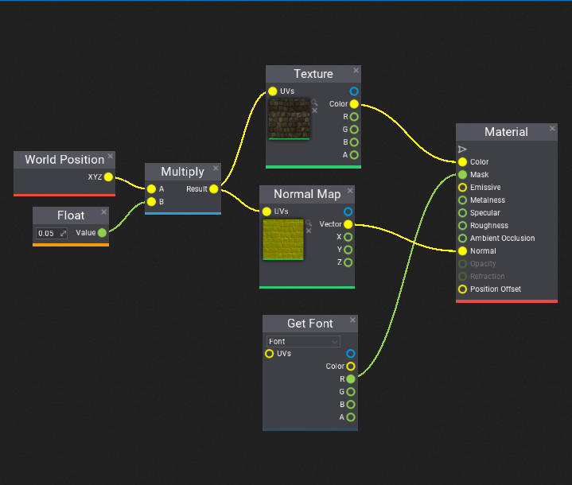
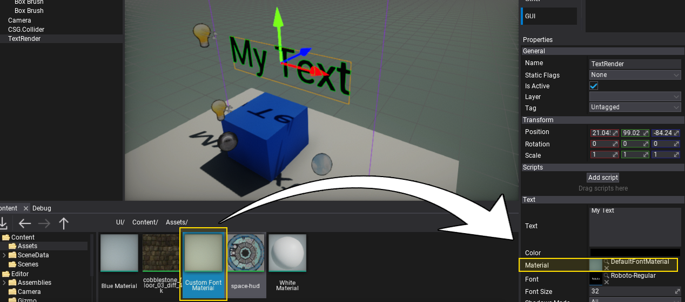
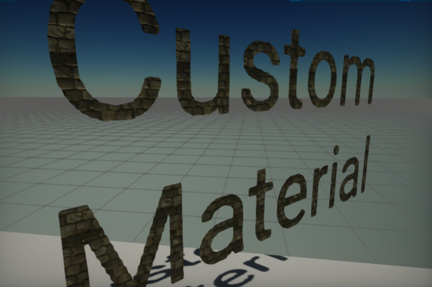
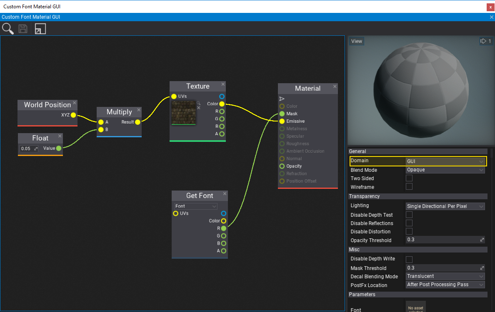

# HOWTO: Create a custom font material

In this tutorial, you will learn how to create a font material that can be used to performa custom shading for text components in your game. Follow these steps to prepare a simple material that uses a texture as an overlay for the text characters.

## 1. Create a `Text Render` or `Label`

The first step is to add a [Text Render](../text-render/index.md) actor or [Label](../controls/label.md) control (with [UI Control](../control/index.md) and [UI Canvas](../canvas/index.md)).

## 2. Create a new material asset

**Right click** in the **Content Window** and select option **New -> Material**. Then specify its name and confirm with Enter. Double-click on created asset and start editing material.

## 3. Create a texture parameter named **Font**

Scroll down the material properties panel and select the new parameter type **Texture**, then press **Add parameter** button. Next **double-click** on a label with created parameter name and rename it to **Font** (Flax uses parameter named `Font` to bind the font atlas texture during rendering).

## 4. Setting up the material graph

In this step you need to create a complete material nodes network based on the following screenshot. To learn more about creating materials and using material parameters see the related documentation [here](../../graphics/materials/index.md).

The created material uses an overlay texture and font characters textures to render glyphs.

If your material will be used in 2D GUI (not *Text Render*) then set its domain to **GUI** and swap Emissive with Color (see the picture in the bottom of the page under section *GUI Text*).

## 5. Assigning the material

The last step is to assign the created material asset to the material property of the text render actor (or custom material if used for GUI control type).

## 6. See the results!

# GUI Text

If you want to use the custom material for rendering text inside the GUI (eg. on *Label* or *Button* controls) then you should follow the tutorial and additionally **set the material domain to GUI and use Emissive/Mask inputs**. 

See the following example:

