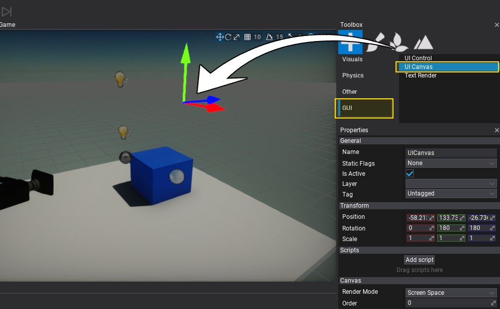
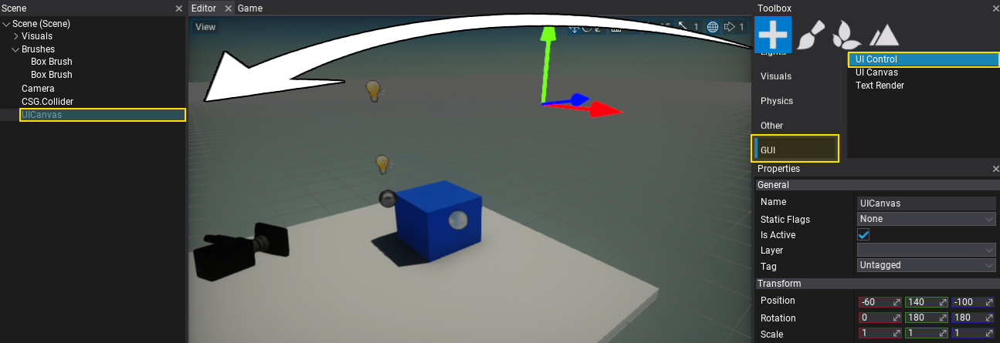
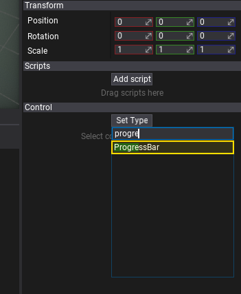
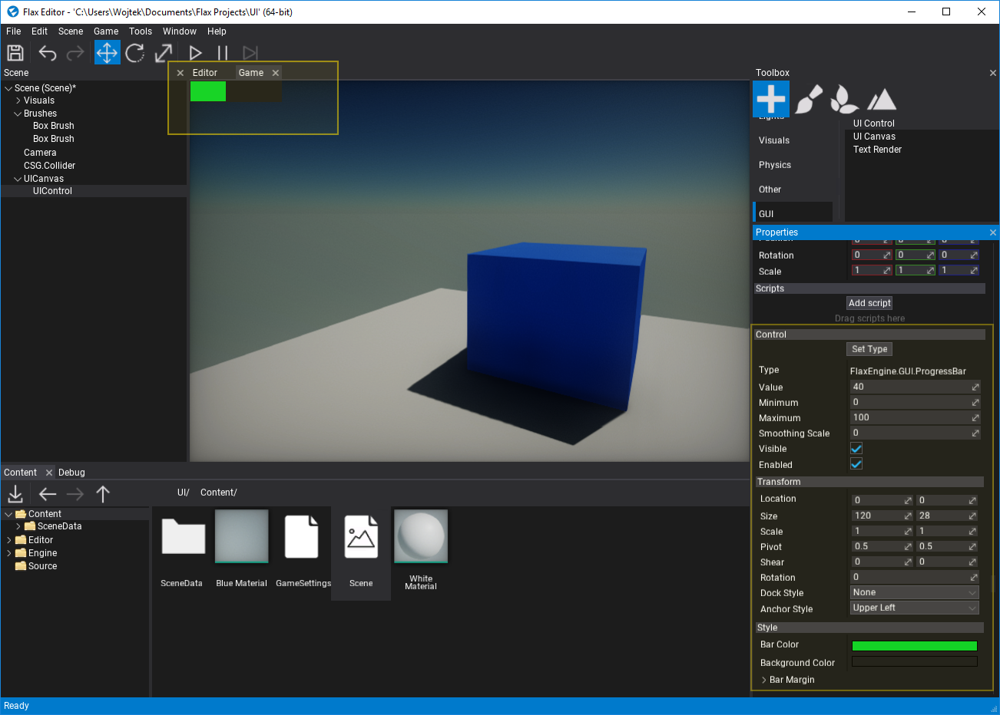
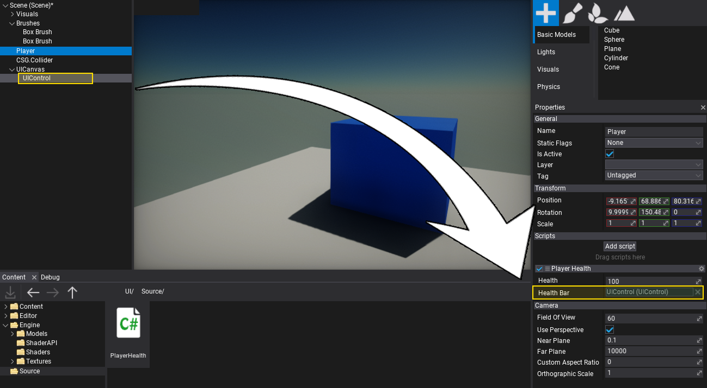
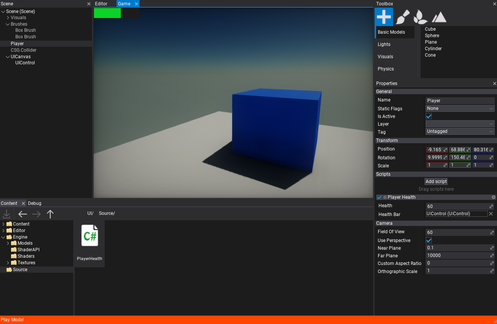

# HOWTO: Create a UI

In this tutorial, you will learn how to create a user interface for your game. Follow these steps to prepare a simple heath bar for your player.

## 1. Create a `UICanvas`

The first step is to add [UI Canvas](../canvas/index.md) actor which is used to render GUI controls. It supports rendering GUI in '*Screen Space*', '*World Space*', and '*Camera Space*'. Use the default option - Screen Space.

To spawn a UI Canvas use the 'Toolbox' window by dragging and dropping the **UI Canvas** from **GUI** section. Alternatively, you can use a Scene Tree window with a dedicated context menu for adding new scene objects.



## 2. Create a `UIControl`

Follow the same steps as in the previous step, except now create a [UI Control](../control/index.md) actor that represents a single GUI control. Add it as a child to the *UI Canvas* (as shown in a picture below).



## 3. Set the control type to `Progress Bar`

The created GUI will use a `Progress Bar` control to visualize the player's health level. To do so, select the spawned **UI Control** and use **Set Type** button to assign its type to **Progress Bar**. Pick the item from the list or type to search it.



Then the `UI Control` actor will link the created conrol to the GUI. Show the **Game** window tab to see the progress bar. You can adjust its properties using the panel below the *Set Type* button.



## 4. Create a `PlayerHealth` script

Add a new script named `PlayerHealth` that will control the player's health level and update the progress bar to visualize it. To learn more about creating and using scripts see [this tutorial](../../scripting/new-script.md).

## 5. Edit the script

Open the script file and write the following code:

```cs
using FlaxEngine;
using FlaxEngine.GUI;

namespace Game
{
	public class PlayerHealth : Script
	{
		[Limit(0, 100), Tooltip("The current player health (in range 0-100)")]
		public float Health { get; set; } = 100.0f;

		[Tooltip("Reference to the player health progress bar control")]
		public UIControl HealthBar { get; set; }

		private ProgressBar _healthBar;

		public override void OnStart()
		{
			if (HealthBar == null || !HealthBar.Is<ProgressBar>())
			{
				Debug.LogError("Missing or invalid health bar control");
				return;
			}

			_healthBar = HealthBar.Get<ProgressBar>();
		}

		public override void OnUpdate()
		{
			if (Input.GetKey(KeyboardKeys.Q))
				Health -= 5;

			if (Input.GetKey(KeyboardKeys.E))
				Health += 5;

			Health = Mathf.Clamp(Health, 0, 100);
			_healthBar.Value = Health;
		}
	}
}
```

## 6. Add the script to the player

Now drag and drop the script to the player actor.

## 7. Link the *Progress Bar* control reference to the Player Health script

Select the player actor, next drag and drop the `UIControl` actor created in step no. 2 to assign a reference to it for the script.



## 8. Test it out!

Finally, hit the **Play** button (or **F5** key) and test the player health controller by using the **Q** and **E** keys to change it down or up.

Later you can link your existing gameplay logic to visualize the player's health level or create more of a HUD for your game.



