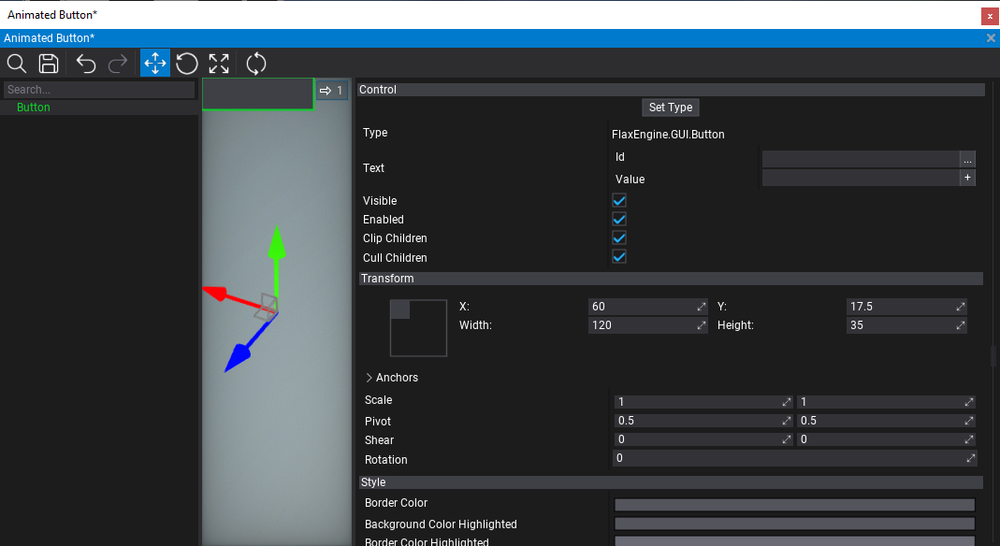
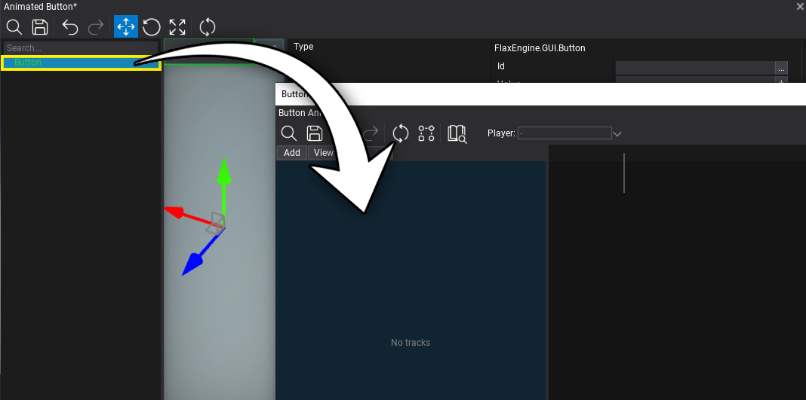
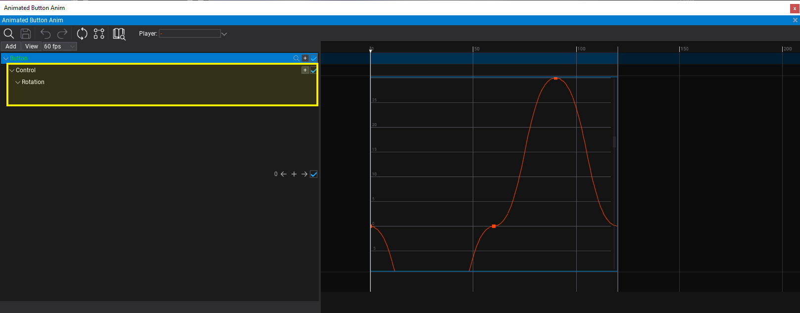
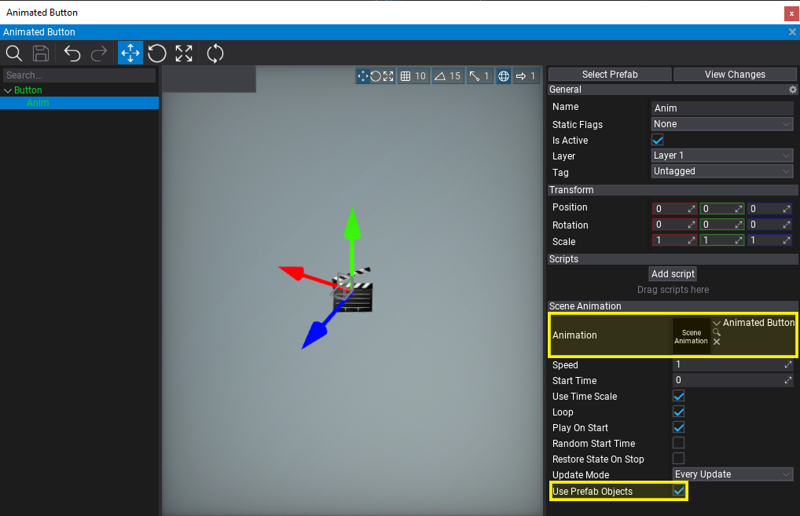
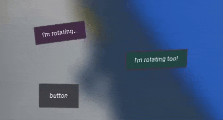

# HOWTO: Creating UI animation in prefab

In this tutorial, you will learn how to create an animation for a user interface that can be reused in prefab. This can be applied to other game objects (eg. doors, traps) which can be reused as prefab and need to contain animation.

## 1. Create prefab

Create UI and convert it into a prefab or set up a prefab from a scratch. In this tutorial, a single button UIControl will be enough.

## 2. Create animation

*Right-click* in Content window to add **new Scene Animation** asset. Name it and open it to edit.

## 3. Add track with prefab actor

Now drag and drop the actor from the prefab editor window into the scene animation tracks panel. It will add a new track with that object animation. **Track label will be green to indicate that it's prefab**.

## 4. Animate UI properties

Now, add new sub-tracks with properties animation. For UI control such as Button add sub-track **Control** first and then animate the control properties.

## 5. Add Scene Animation Player

Now, add a new **Scene Animation Player** to that prefab (eg. as a child to the animated button), link the created animation asset and check the **Use Prefab Objects** property to ensure that player will automatically use prefab instance objects for the animation.

## 6. Test it out!

Finally, spawn this prefab into the level (once or multiple times), hit the **Play** button (or **F5** key), and test the animation playback.

