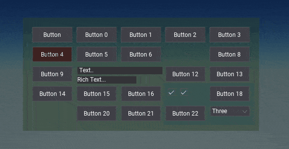
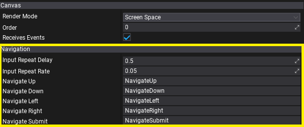
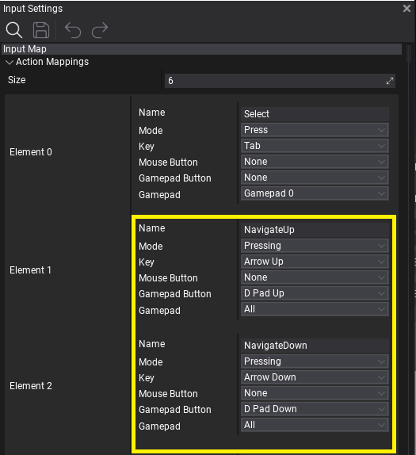
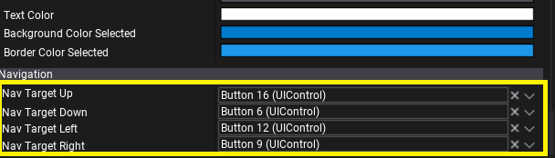

# UI Navigation

**UI Navigation**  allows to perform focus navigation around the user interface by using input actions such as keyboard arrows or gamepad keys. This feature is essential for console games or others with gamepad support which aim to give full UI usability without mouse input nor touch input from the user.

## Navigation Setup

[UI Canvas](canvas/index.md) contains properties for Navigation setup such as input timings and input actions names (defined in Input Settings) to use for the navigation triggering. By adding Input Actions to [Input Settings](../input/input-settings.md) with actions for Up/Down/Left/Right/Submit the canvas will trigger the UI navigation. You can also adjust the navigation input delay and rate.

After proper input setup the UI will automatically route the focus navigation. The navigation flow is based on controls that have `Auto Focus` property enabled, which is set by default for all interactible controls like buttons, chexboxes and dropdown lists. You can manually include or exclude other controls from navigation or even override navigation per-control by using explicity `Nav Target` properties on UI Control.

## Custom Controls

If you're working with custom UI controls you can use:
* `IsNavFocused` getter to detect if control is currently focused with navigation focus.
* `NavigationFocus` method to override and respond on navigation focus gain.
* `OnSubmit` method to override action performed when user interacts with a control.
* `GetNavTarget` method to override navigation flow per-control.
* `GetNavOrigin` method to override navigation origin point within a control.
* `OnNavigate` method to override default navigation flow logic.

## Navigation in Editor

Flax Editor uses in-built UI Navigation system and handles:
* `Tab` key to navigate to the next control.
* `Enter` key to submit the user interaction with the focused control or to confirm on the opened dialog.
* `Escape` key to cancel the user interaction with the focused control or to cancel the opened dialog.
* `Arrow` keys to navigate in context menus, list popups, tree hierarchies, etc.
